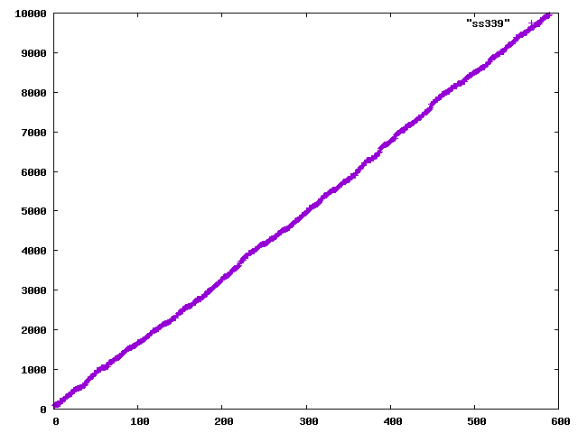

This file is still being populated with notes from previous
experiments.  Pardon our dust.

### 20151229 Subgroup considerations

One possible source of bias mod 540 (say) would be if a_n tended to
miss certain whole subgroups mod 540.  This seems kind of attractive
based on the fact that 540 has a lot of divisors (though this isn't
always true of the other denominators in the continued fraction
expansion) and so Z/540 has many subgroups.  If, for example, at some
point it turned out that all the elements of the sequence were a fixed
list of subgroups mod 540, then because to generate future elements
all we do is add previous elements, we could only ever climb the
subgroup lattice and might continue to miss subgroups not containing
the ones we've seen.

Of course, this idea as stated is a non-starter because a_1 = 1
generates the whole group.  However, in the first 10000 terms, 1 only
shows up as a summand as 2+1, 3+1, and 47+1 and then never again, so
maybe some approximate version of this is true.

We compute using `experiment9`: 


```
Format: divisor of 540, number of a_n in that subgroup, number of integers 1..10000 in that subgroup
1 : 2625 =? 2666
2 : 1342 =? 1333
3 : 916 =? 888
4 : 1351 =? 1333
5 : 667 =? 666
6 : 443 =? 444
9 : 289 =? 296
10 : 346 =? 333
12 : 416 =? 444
15 : 228 =? 222
18 : 170 =? 148
20 : 334 =? 333
27 : 187 =? 148
30 : 104 =? 111
36 : 126 =? 148
45 : 90 =? 74
54 : 31 =? 74
60 : 104 =? 111
90 : 0 =? 37
108 : 89 =? 74
135 : 1 =? 37
180 : 75 =? 37
270 : 66 =? 18
540 : 0 =? 18
```

Notably, for 540, everything seems to show up about as often as
predicted except for 90, 135, and 540, which, surprisingly, show up
basically never.

We note that the absence of 90 is truly a "mod 540" phenomenon, since
mod 270, say, the elements that generate the subgroup generated by 180
mod 540 will be in the subgroup generated by 90 by 270, so we will get
about the expected number of these.  However, 135 is still absent mod
270.

This phenomenon is not really strong enough to account for the
substantial bias observed, however, and nor does it happen uniformly
among denominators of the continued fraction.  For 259, we observe: 

```
1 : 8381 =? 8339
7 : 1360 =? 1389
37 : 216 =? 231
259 : 43 =? 38
```

```
1 : 9051 =? 9057
11 : 909 =? 905
271 : 40 =? 33
2981 : 0 =? 3
```

```
1 : 4934 =? 4932
2 : 2468 =? 2466
4 : 2470 =? 2466
139 : 36 =? 35
157 : 33 =? 31
278 : 15 =? 17
314 : 19 =? 15
556 : 13 =? 17
628 : 12 =? 15
21823 : 0 =? 0
43646 : 0 =? 0
87292 : 0 =? 0
```

So why it is exactly that 90 and 135 never show up mod 540 is unclear,
but this could be random (they never showed up to begin with, and so
are unlikely to show up in future) and this isn't the cause of the
bias, most likely.

It is perhaps not terribly surprising that this isn't the answer:
clustering into two peaks mod 540 is not a particularly
algebraic-sounding phenomenon.

### 20151230 Evolving a distribution

Another possible source of the bias mod 540 is that some level of bias
simply happens by accident for a_i < 540 (maybe it is expected for at
least some modulus) and then, once you have this distribution, making
the next element of the sequence by picking two elements randomly from
this distribution (e.g. around 249 and 349 are the two peaks mod 540,
so maybe it's likely to pick e.g. 249 + 349 for the next congruence
class).

Under this assumption, we can evolve the distribution which starts
(using the first 10000 elements) like:


and, under this evolution, gets smeared out to: 


Also unsurprising, but at least worth checking.

### 20151230 A correlation between summands and cos(alpha*a_n)

We note with interest the observation in the abstract of Steinerberger
that cos(alpha*a_n) < 0 for all a_n other than 2, 3, 47, and 69.  In
particular, thee were also the a_n that showed up most frequently as
summands in our earlier computation.

So we compute which how often each a_n appears as the smaller summand
of a later a_i and we compute cos(alpha*a_n) for each and sort by this
quantity.  We note what looks like a very strong correlation between
how often a_n shows up as a summand and cos(alpha*a_n) in the
resulting table, computed by `experiment11`:

```
Format: a_n, # a_i such that a_n is the smaller summand of a_i, cos(alpha_{1,2} * a_n) [a_i : a_i = a_n + a_*]

2 3630 0.41733070262870486 [6, 8, 13, 18, 28, 38, 99, 177, 182, 221, 238, ...
3 1356 0.13918577174048308 [11, 16, 72, 102, 148, 180, 209, 241, 319, 412, ...
47 1190 0.09314945116148635 [236, 253, 356, 363, 429, 456, 544, 720, 732, ...
69 999 0.07005004608158771 [175, 258, 451, 483, 566, 820, 1018, 1052, 1101, ...
102 836 -0.03533426907901862 [282, 441, 502, 585, 624, 646, 668, 949, 1125, ...
339 589 -0.0711987488469575 [695, 739, 751, 861, 905, 1186, 1230, 1770, 1853, ...
36 465 -0.10468116468523993 [138, 309, 602, 927, 1191, 1550, 1682, 2090, 2288, ...
273 305 -0.1403260484112354 [612, 673, 685, 1164, 1296, 1308, 1428, 1660, 1765, ...
8 181 -0.15065198092326257 [26, 36, 77, 114, 197, 324, 390, 991, 1470, 1602, ...
2581 85 -0.28740411578013597 [5795, 7459, 8947, 9443, 9619, 9641, 9663, 10677, ...
400 55 -0.2884371848720607 [3214, 3605, 3991, 12763, 13562, 13799, 13931, 15160, ...
983 50 -0.3160870169407304 [2445, 2748, 5514, 9553, 16121, 17135, 19427, 21626, ...
97 47 -0.3204537967301412 [316, 370, 497, 1252, 2581, 3622, 4057, 10366, 13628, ...
356 21 -0.33249578951071784 [983, 4118, 11226, 22676, 27817, 34104, 34969, 52789, ...
1155 16 -0.34664508490498336 [4878, 9132, 13733, 16047, 27883, 30886, 38920, 40931, ...
206 33 -0.35210835605364843 [522, 891, 1155, 1514, 2787, 4324, 9399, 11432, 20375, ...
53 35 -0.36400375717687433 [155, 409, 1208, 3038, 5049, 8421, 14945, 16648, 19480, ...
1308 18 -0.3694282571996273 [3029, 8368, 10501, 20937, 29147, 34784, 37765, 61029, ...
9193 8 -0.39212546438962775 [20419, 68914, 74099, 83323, 92073, 108317, 123718, 124864]
10831 4 -0.4275703245958347 [31878, 56503, 89101, 126493]
13 6 -0.4278336499870973 [82, 219, 273, 19642, 59734, 91748]
14892 2 -0.43270258250883076 [41620, 84500]
13531 3 -0.4379518060471682 [47279, 61451, 83139]
23883 2 -0.4409365382548865 [65740, 106394]
10269 1 -0.4463455890816818 [44816]
8368 1 -0.4494994835242297 [20968]
20643 0 -0.45329707066551345 []
316 5 -0.4579687420768522 [2897, 9509, 37809, 44377, 45132]
30315 1 -0.4603261098428447 [64928]
3205 1 -0.46097252485489365 [89057]
56437 0 -0.4623937767448221 []
4118 0 -0.46422907716529205 []
10247 0 -0.46696423929912617 []
3038 2 -0.4683040193517334 [7156, 95616]
57 3 -0.46925689465650167 [126, 339, 9250]
483 1 -0.4712894777269175 [80891]
60665 0 -0.4719075620475581 []
63646 0 -0.47285836474034365 []
39912 1 -0.4732674578528013 [128969]
1023 3 -0.47331956082924576 [2178, 20643, 65705]
69608 0 -0.4747583182234548 []
47920 0 -0.4752710197227344 []
123683 0 -0.47626799121658503 []
33274 1 -0.48172182638061584 [97956]
11586 0 -0.4822323173406816 []
75706 0 -0.482256288588461 []
128969 0 -0.48251534075104174 []
3723 1 -0.4834321003782536 [34038]
39653 1 -0.484451819395134 [84469]
42217 0 -0.484555301907165 []
```

If nothing else, this might suggest to us how to compute more a_n more
quickly: Rather than searching previous summands in order, search in
the order given by using cos(alpha*a_n) as the index.  Once we find a
sum that is unique, we only have to search all smaller sums, again in
this order.  This isn't easy, but 

## 20151231 Experiment 7, revisited

`experiment7` now uses a new (hopefully more refined) method for
computing alpha for various sequences and gives, after about a 5
minute computation for each:

```
1,2 (2.5714479999999997, 1586.3495100297046)
1,3 (2.8334960000000002, 1587.3716251000853)
2,3 (1.184224, 1497.1305405102953)
12,13 (3.141592, 1847.9732996138823)
```

We note that alpha_{2,3} is different from that in Steinberger.
Unclear whether this is a programming error or another peak or what.

### 20151231 Frequency of a_n as a summand, revisited

We run `experiment11(u1_2, alpha1_2)` to compute 

```
python test.py | grep '^2 ' | sed 's/.*[[]//;s/]//;s/, /\n/g'|nl -ba > ss2
python test.py | grep '^3 ' | sed 's/.*[[]//;s/]//;s/, /\n/g'|nl -ba > ss3
```

The data for i such that a_i = 2 + a_n (some n) is plotted here: 


and for the a_i with 3, 47, 69, 273, 339, and 8 (respectively) as a summand:





Looks quite linear.  Indeed, computing the lines of best fit like:

```
gnuplot> f(x) = a*x+b
gnuplot> fit f(x) "data/ss2" u 1:2 via a,b
```

we get:

```
2:   2.73325 x + 89.98
3:   7.39206 x - 68.4331
47:  8.21144 x + 103.419
69:  10.0008 x + 130.561
273: 17.0196 x - 58.678
339: 33.4172 x - 5.79674
8:   57.7111 x - 229.248
```
