This file is still being populated with notes from previous
experiments.  Pardon our dust.

### Takeaways so far:

* [link](#20151220-linearity-of-f_n-in-n) With `f_N(x)` the fourier
  transform of the indicator function of `a_n` (in Steinerberger's
  sense), `f_N(alpha)` grows linearly in N.

* [link](#20151221-more-alphas) Possibly alpha_(x,x+1) = pi for x that are >= 12 and are even

* [link](#20151221-more-alphas) Possibly alpha_(1,x) -> 0 as x -> infinity

* [link](#20151221-continued-fractions) The a_i are very unusually biased mod 540, and generally
  are biased modulo the denominators of the continued fraction
  convergents of alpha

* [link](#20151221-continued-fractions) In general, if we're imagining `alpha = 2pi*k/m` (where k
  is related to the set of favoured congruence classes mod m), then
  there are several available choices for k but only one that gives
  the apparent continuity observed.  For example, `10839*alpha mod 2pi
  = 5.9926...` works about as well as alpha for giving a peak in the
  Fourier transform.

* [link](#20151229-subgroup-considerations) Whatever is going on is
  not purely algebraic.

* [link](#20151230-evolving-a-distribution) Whatever is going on is
  not a result of something that can be simulated by a simple random
  process.

* [link](#20151230-a-correlation-between-summands-and-cosalphaa_n) How
  likely a_n is to be used as a summand of a later a_i is not at all
  random, but appears instead to be correlated with the value of
  cos(alpha*a_n)

* [link](#20151231-frequency-of-a_n-as-a-summand-revisited) The set of
  i for which a_n appears as a summand appears to have fixed density,
  whose numerical value is somehow correlated with `cos(alpha*a_n)`
  (or, perhaps equivalently but more simply, with the distance between
  `alpha*a_n mod 2pi` and pi.

* [link](#20160101-large-summands) Each `a_n` can be written in a unique was as `a_i + a_j`.  In the
  first 10000 a_n, there are only 312 unique pairs `(i, n-j)`.

* [link](#20160102-more-data) Each `a_n` can be written in a unique
  was as `a_i + a_j`.  In the first 100000 a_n, there are only 662
  unique pairs `(i, n-j)`.

### 20151220 Linearity of f_N in N


### 20151221 More alphas

We compute these in `experiment1` and `experiment2`

```
Format: a1 a2 (optimal alpha, approximated to four decimal places, ||F_200||^2 (only meaningful if orders of magnitude bigger than 200))

1 2 (2.571600000001008, 23348.35938929195)
1 3 (2.8334000000015607, 24293.720371257674)
1 4 (2.094400000000001, 39007.46385460891)
1 5 (1.7648999999998278, 26597.042612213307)
1 6 (4.833200000002081, 32338.778040479963)
1 7 (0.32669999999998606, 24192.1315190365)
1 8 (0.2736999999999919, 25928.99448125898)
1 9 (6.038099999999273, 26372.972667249553)
1 10 (6.061699999999218, 25717.807140737834)
1 11 (6.083299999999167, 25743.731352831754)
1 12 (6.101599999999125, 25737.80981551202)
1 13 (6.115499999999092, 25926.87112676625)
1 14 (6.124499999999071, 25983.886809829368)
1 15 (6.135699999999045, 25647.874299833387)
1 16 (6.1453999999990225, 26048.466535913547)
1 17 (6.155099999999, 26086.336559974516)
1 18 (6.158099999998993, 26167.0885135168)
1 19 (6.166099999998974, 26600.041630256266)
1 20 (6.174099999998956, 25678.082435323184)
1 2 (2.571600000001008, 23348.35938929195)
2 3 (1.1841999999998918, 16192.09475962663)
3 4 (5.380900000000804, 26414.80301587582)
4 5 (5.600000000000294, 21640.564248470706)
5 6 (2.0588999999999262, 22783.571558654858)
6 7 (2.6889000000012557, 19502.053865731123)
7 8 (3.9426000000039014, 23910.35721534735)
8 9 (3.490300000002947, 19172.229899792306)
9 10 (5.955799999999464, 13422.672633312626)
10 11 (3.4270000000028134, 17537.29505082042)
11 12 (6.00919999999934, 14069.21195102112)
12 13 (3.141600000002211, 17955.65635464096)
13 14 (2.9106000000017236, 18768.829084251494)
14 15 (3.141600000002211, 19043.701112532486)
15 16 (2.940100000001786, 15916.092915960573)
16 17 (3.141600000002211, 23103.745481433194)
17 18 (2.963400000001835, 17551.757008092867)
18 19 (3.141600000002211, 21903.769889105457)
19 20 (6.123199999999074, 15870.335860431833)
```

So for example, when a1 = 12, a2 = 13, it looks like alpha = pi, which seems to be confirmed for this particular instance by computing more terms and searching with more precision.  This is saying that the a_i are very biased mod 2pi/pi = 2, which seems experimentally to be very much the case even out to thousands of terms (for this particular example): the a_i are over 80% odd.  Proving something in this direction seems accessible, but some first efforts were unfruitful.

Note for example
  that in the extreme case where a_i = r mod m for all i, |f_N(2pi/m)|
  will be N on the nose.  If instead a_i is only ever congruent to r
  or s mod m, then if k = 1/(r-s) mod m, then again |f_N(2pi*k/m)| is
  close to N.

In general, one could imagine that for whatever initial values, the existence of such alpha is saying the a_i prefer a set of congruence classes mod m for some (possibly large) m.  In this case, alpha could be 2pi*k/m for some k.  (To see what k is, think what happens if the a_i happen to biased toward only two congruence classes r and s modulo m, then k would be such that kr and ks are all as close as possible mod m, say k = 1/(s-r) mod m.  If the preference is for more than two congruence classes, then the choice of k seems complicated (though still elementary): Given r1, ... rM mod m, find the k such that the k*r_i are all "as tightly clustered as possible".  There could be multiple k that do the job well, even if one of them is the very best.


### 20151221 Continued fractions


It is more likely that there is a sequence of m mod which the
congruence classes of a_i are increasingly clustered.  The continued
fraction of 2pi/alpha, which we're imagining is m/k, doesn't have some
really large coefficient where we would obviously truncate it.
Instead, for 2pi/alpha_(1,2) it is just

```[2; 2, 3, 1, 11, 1, 1, 4, 1, 1, 7, 2, 2, 6, 5, 3, 1, 3, 1, 2, 1, 3, 2, 1, 14, 2, 5, 3, 2, 3, 1, 2, 13, 2]```

For most of the alpha(i,j) that we computed to any meaningful
precision, either this continues to be true, or there is a very small
obvious modulus like 2.


There may not be a single best m: For example, one could imagine a sequence that is slightly biased to being odd, say 60% are 1 mod 2.  But then in fact it turns out that mod 4, it is more strongly biased, with 65% being only 2 or 3 mod 4.  And maybe in fact mod 12, 80% of terms are only ever 2, 3, 6, or 8 mod 12, and maybe in fact 99% are 2, 3, 6, 8, or 1 mod 48, and maybe you can catch more and more of the sequence with a slowly expanding set of congruence classes modulo quickly growing modulus.  If there is a "bias mod m" thing happening, this is probably the flavour it takes, but I'm happy to try to treat the approximation to alpha as indicating an "at least some bias toward some congruence classes mod some fixed m" phenomenon.

```
Format: c < 41000,  c*alpha mod 2pi,  |f_1000(c*alpha)| if "large enough"

1 2.5714474995 792.4132845820646
5421 3.7118834651791985 697.9602738649951
5423 2.571593156997551 667.6433815922704
10843 3.7120291226783593 430.5852814483841
10845 2.5717388144948927 382.76395161416815
19246 3.711096030579938 188.76234341111504
27109 3.7124660951667465 192.74127423547188
27111 2.572175787005108 192.3664947764681
30090 3.7113873455818975 251.33288416753032
30092 2.571097037391155 299.91484894398576
35512 3.7115330030792393 564.7163838117917
35514 2.5712426948884968 604.3427231679284
40934 3.711678660576581 767.1522122115849
40936 2.5713883524003904 780.2228219170503
```

### 20151229 Subgroup considerations

One possible source of bias mod 540 (say) would be if a_n tended to
miss certain whole subgroups mod 540.  This seems kind of attractive
based on the fact that 540 has a lot of divisors (though this isn't
always true of the other denominators in the continued fraction
expansion) and so Z/540 has many subgroups.  If, for example, at some
point it turned out that all the elements of the sequence were a fixed
list of subgroups mod 540, then because to generate future elements
all we do is add previous elements, we could only ever climb the
subgroup lattice and might continue to miss subgroups not containing
the ones we've seen.

Of course, this idea as stated is a non-starter because a_1 = 1
generates the whole group.  However, in the first 10000 terms, 1 only
shows up as a summand as 2+1, 3+1, and 47+1 and then never again, so
maybe some approximate version of this is true.

We compute using `experiment9`: 


```
Format: divisor of 540, number of a_n in that subgroup, number of integers 1..10000 in that subgroup
1 : 2625 =? 2666
2 : 1342 =? 1333
3 : 916 =? 888
4 : 1351 =? 1333
5 : 667 =? 666
6 : 443 =? 444
9 : 289 =? 296
10 : 346 =? 333
12 : 416 =? 444
15 : 228 =? 222
18 : 170 =? 148
20 : 334 =? 333
27 : 187 =? 148
30 : 104 =? 111
36 : 126 =? 148
45 : 90 =? 74
54 : 31 =? 74
60 : 104 =? 111
90 : 0 =? 37
108 : 89 =? 74
135 : 1 =? 37
180 : 75 =? 37
270 : 66 =? 18
540 : 0 =? 18
```

Notably, for 540, everything seems to show up about as often as
predicted except for 90, 135, and 540, which, surprisingly, show up
basically never.

We note that the absence of 90 is truly a "mod 540" phenomenon, since
mod 270, say, the elements that generate the subgroup generated by 180
mod 540 will be in the subgroup generated by 90 by 270, so we will get
about the expected number of these.  However, 135 is still absent mod
270.

This phenomenon is not really strong enough to account for the
substantial bias observed, however, and nor does it happen uniformly
among denominators of the continued fraction.  For 259, we observe: 

```
1 : 8381 =? 8339
7 : 1360 =? 1389
37 : 216 =? 231
259 : 43 =? 38
```

```
1 : 9051 =? 9057
11 : 909 =? 905
271 : 40 =? 33
2981 : 0 =? 3
```

```
1 : 4934 =? 4932
2 : 2468 =? 2466
4 : 2470 =? 2466
139 : 36 =? 35
157 : 33 =? 31
278 : 15 =? 17
314 : 19 =? 15
556 : 13 =? 17
628 : 12 =? 15
21823 : 0 =? 0
43646 : 0 =? 0
87292 : 0 =? 0
```

So why it is exactly that 90 and 135 never show up mod 540 is unclear,
but this could be random (they never showed up to begin with, and so
are unlikely to show up in future) and this isn't the cause of the
bias, most likely.

It is perhaps not terribly surprising that this isn't the answer:
clustering into two peaks mod 540 is not a particularly
algebraic-sounding phenomenon.

### 20151230 Evolving a distribution

Another possible source of the bias mod 540 is that some level of bias
simply happens by accident for a_i < 540 (maybe it is expected for at
least some modulus) and then, once you have this distribution, making
the next element of the sequence by picking two elements randomly from
this distribution (e.g. around 249 and 349 are the two peaks mod 540,
so maybe it's likely to pick e.g. 249 + 349 for the next congruence
class).

Under this assumption, we can evolve the distribution which starts
(using the first 10000 elements) like:

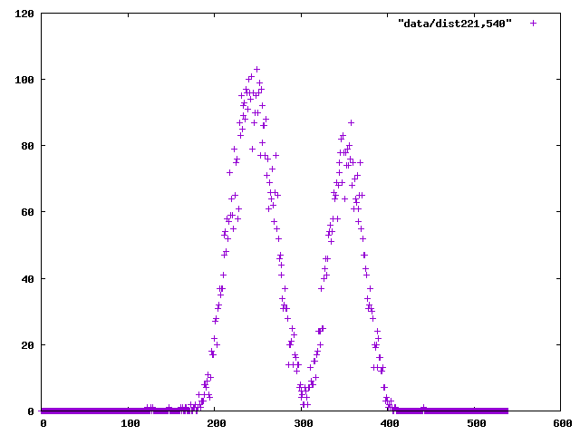

and, under this evolution, gets smeared out to: 

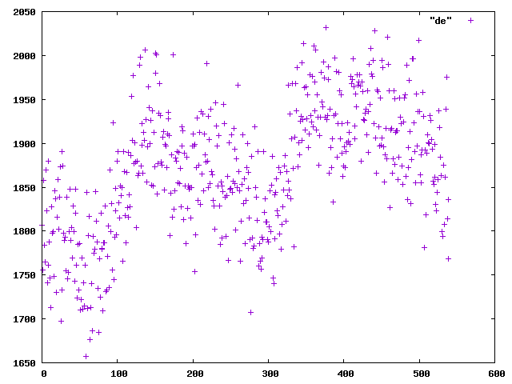

Also unsurprising, but at least worth checking.

### 20151230 A correlation between summands and cos(alpha*a_n)

We note with interest the observation in the abstract of Steinerberger
that cos(alpha*a_n) < 0 for all a_n other than 2, 3, 47, and 69.  In
particular, thee were also the a_n that showed up most frequently as
summands in our earlier computation.

So we compute which how often each a_n appears as the smaller summand
of a later a_i and we compute cos(alpha*a_n) for each and sort by this
quantity.  We note what looks like a very strong correlation between
how often a_n shows up as a summand and cos(alpha*a_n) in the
resulting table, computed by `experiment11`:

```
Format: a_n, # a_i such that a_n is the smaller summand of a_i, cos(alpha_{1,2} * a_n) [a_i : a_i = a_n + a_*]

2 3630 0.41733070262870486 [6, 8, 13, 18, 28, 38, 99, 177, 182, 221, 238, ...
3 1356 0.13918577174048308 [11, 16, 72, 102, 148, 180, 209, 241, 319, 412, ...
47 1190 0.09314945116148635 [236, 253, 356, 363, 429, 456, 544, 720, 732, ...
69 999 0.07005004608158771 [175, 258, 451, 483, 566, 820, 1018, 1052, 1101, ...
102 836 -0.03533426907901862 [282, 441, 502, 585, 624, 646, 668, 949, 1125, ...
339 589 -0.0711987488469575 [695, 739, 751, 861, 905, 1186, 1230, 1770, 1853, ...
36 465 -0.10468116468523993 [138, 309, 602, 927, 1191, 1550, 1682, 2090, 2288, ...
273 305 -0.1403260484112354 [612, 673, 685, 1164, 1296, 1308, 1428, 1660, 1765, ...
8 181 -0.15065198092326257 [26, 36, 77, 114, 197, 324, 390, 991, 1470, 1602, ...
2581 85 -0.28740411578013597 [5795, 7459, 8947, 9443, 9619, 9641, 9663, 10677, ...
400 55 -0.2884371848720607 [3214, 3605, 3991, 12763, 13562, 13799, 13931, 15160, ...
983 50 -0.3160870169407304 [2445, 2748, 5514, 9553, 16121, 17135, 19427, 21626, ...
97 47 -0.3204537967301412 [316, 370, 497, 1252, 2581, 3622, 4057, 10366, 13628, ...
356 21 -0.33249578951071784 [983, 4118, 11226, 22676, 27817, 34104, 34969, 52789, ...
1155 16 -0.34664508490498336 [4878, 9132, 13733, 16047, 27883, 30886, 38920, 40931, ...
206 33 -0.35210835605364843 [522, 891, 1155, 1514, 2787, 4324, 9399, 11432, 20375, ...
53 35 -0.36400375717687433 [155, 409, 1208, 3038, 5049, 8421, 14945, 16648, 19480, ...
1308 18 -0.3694282571996273 [3029, 8368, 10501, 20937, 29147, 34784, 37765, 61029, ...
9193 8 -0.39212546438962775 [20419, 68914, 74099, 83323, 92073, 108317, 123718, 124864]
10831 4 -0.4275703245958347 [31878, 56503, 89101, 126493]
13 6 -0.4278336499870973 [82, 219, 273, 19642, 59734, 91748]
14892 2 -0.43270258250883076 [41620, 84500]
13531 3 -0.4379518060471682 [47279, 61451, 83139]
23883 2 -0.4409365382548865 [65740, 106394]
10269 1 -0.4463455890816818 [44816]
8368 1 -0.4494994835242297 [20968]
20643 0 -0.45329707066551345 []
316 5 -0.4579687420768522 [2897, 9509, 37809, 44377, 45132]
30315 1 -0.4603261098428447 [64928]
3205 1 -0.46097252485489365 [89057]
56437 0 -0.4623937767448221 []
4118 0 -0.46422907716529205 []
10247 0 -0.46696423929912617 []
3038 2 -0.4683040193517334 [7156, 95616]
57 3 -0.46925689465650167 [126, 339, 9250]
483 1 -0.4712894777269175 [80891]
60665 0 -0.4719075620475581 []
63646 0 -0.47285836474034365 []
39912 1 -0.4732674578528013 [128969]
1023 3 -0.47331956082924576 [2178, 20643, 65705]
69608 0 -0.4747583182234548 []
47920 0 -0.4752710197227344 []
123683 0 -0.47626799121658503 []
33274 1 -0.48172182638061584 [97956]
11586 0 -0.4822323173406816 []
75706 0 -0.482256288588461 []
128969 0 -0.48251534075104174 []
3723 1 -0.4834321003782536 [34038]
39653 1 -0.484451819395134 [84469]
42217 0 -0.484555301907165 []
```

If nothing else, this might suggest to us how to compute more a_n more
quickly: Rather than searching previous summands in order, search in
the order given by using cos(alpha*a_n) as the index.  Once we find a
sum that is unique, we only have to search all smaller sums, again in
this order.  This isn't easy, but 

## 20151231 Experiment 7, revisited

`experiment7` now uses a new (hopefully more refined) method for
computing alpha for various sequences and gives, after about a 5
minute computation for each:

```
1,2 (2.5714479999999997, 1586.3495100297046)
1,3 (2.8334960000000002, 1587.3716251000853)
2,3 (1.184224, 1497.1305405102953)
12,13 (3.141592, 1847.9732996138823)
```

We note that alpha_{2,3} is different from that in Steinerberger.
Unclear whether this is a programming error or another peak or what.

### 20151231 Frequency of a_n as a small summand, revisited

We run `experiment11(u1_2, alpha1_2)` to compute 

```
python test.py | grep '^2 ' | sed 's/.*[[]//;s/]//;s/, /\n/g'|nl -ba > ss2
python test.py | grep '^3 ' | sed 's/.*[[]//;s/]//;s/, /\n/g'|nl -ba > ss3
```

The data for i such that a_i = 2 + a_n (some n) is plotted here: 

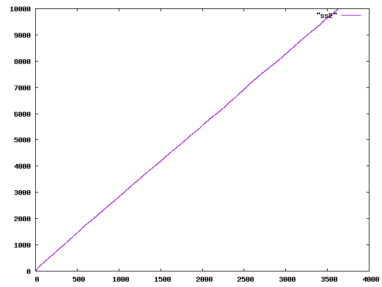

and for the a_i with 3, 47, 69, etc. as summands:

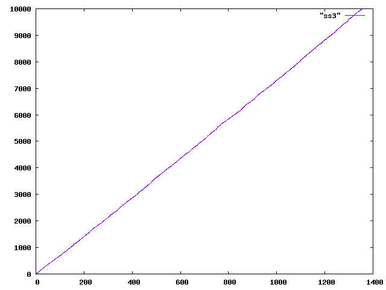
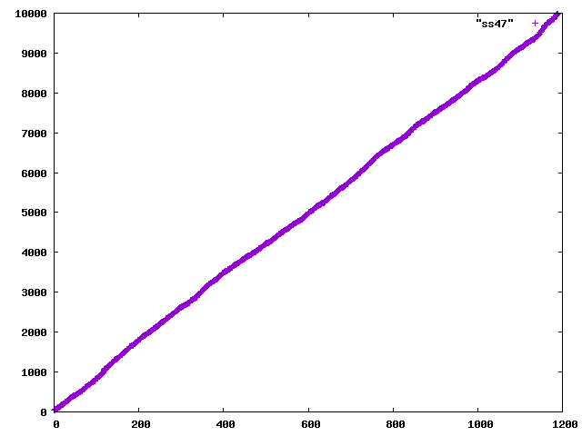
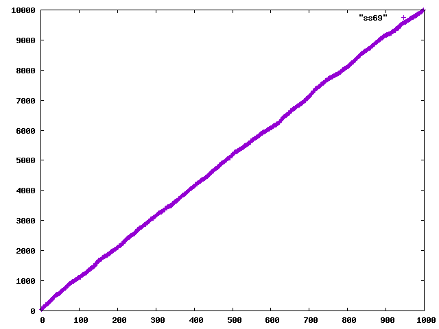
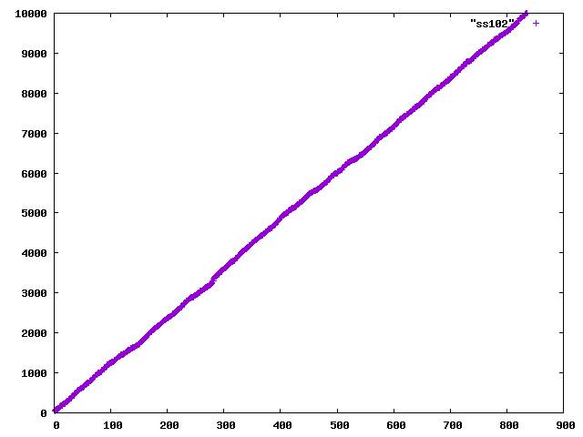
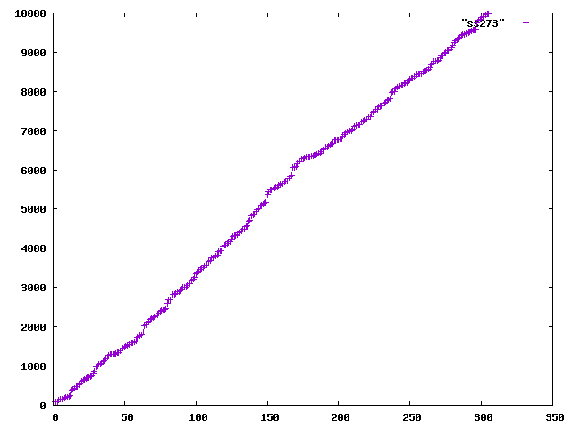

Looks quite linear.  Indeed, computing the lines of best fit like:

```
gnuplot> f(x) = a*x+b
gnuplot> fit f(x) "data/ss2" u 1:2 via a,b
```

we get:

```
a_n   line of best fit      density of i with a_n a summand of a_i
=================================================================
2:    2.73325 x + 89.98     .36586481295161437848
3:    7.39206 x - 68.4331   .13528028722710584059
47:   8.21144 x + 103.419   .12178131971980553958
69:   10.0008 x + 130.561   .09999200063994880409
102:  11.9520 x + 16.9218   .08366800535475234270
339:  17.0196 x - 58.678    .05875578744506333873
36:   21.1842 x + 117.105   .04720499239999622360
273:  33.4172 x - 5.79674   .02992470943107142429
8:    57.7111 x - 229.248   .01732768912739490323
2581: 112.838 x - 415.223   .00886226271291586167
```

One thing that we see from the later plots, e.g.

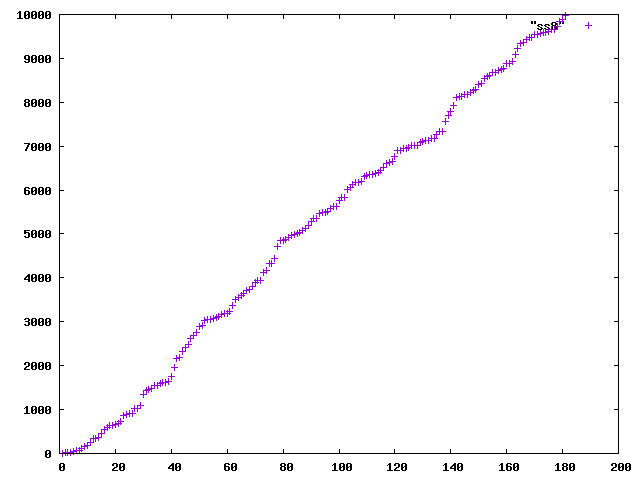

is that the graph seems to oscillate around the line of best fit.  To
this end, we take a few of these and subtract the lines of best fit to
see if we get something particularly striking:

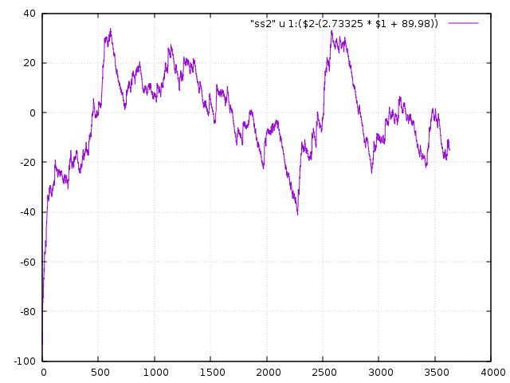
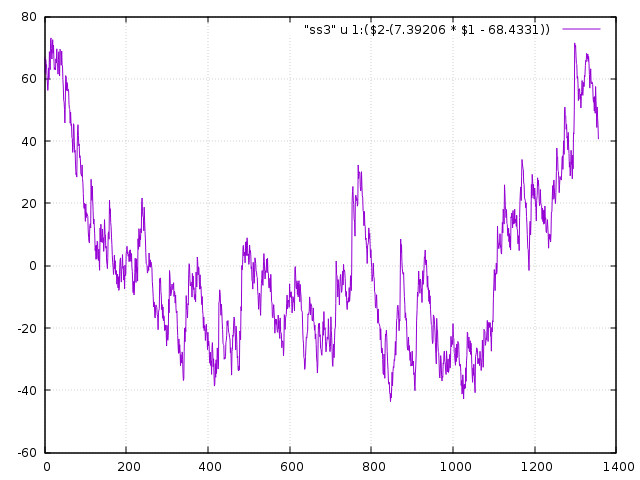
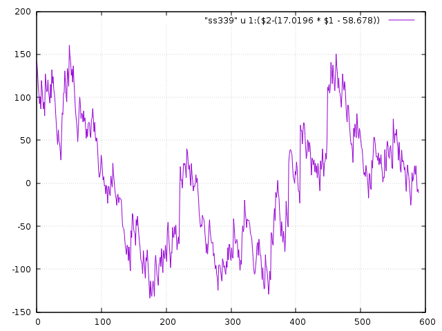
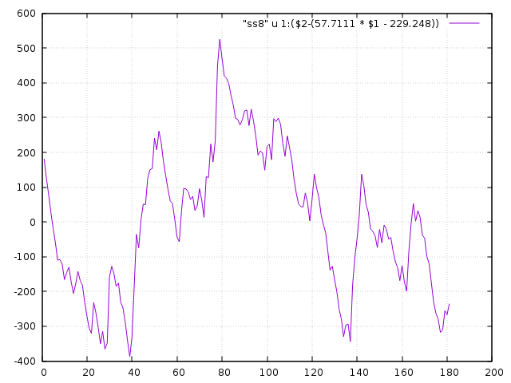

Unclear...

We can also take these densities against the values of cos(alpha*x)
and plot them:

```
0.41733070262870486    .36586481295161437848
0.13918577174048308    .13528028722710584059
0.09314945116148635    .12178131971980553958
0.07005004608158771    .09999200063994880409
-0.03533426907901862   .08366800535475234270
-0.0711987488469575    .05875578744506333873
-0.10468116468523993   .04720499239999622360
-0.1403260484112354    .02992470943107142429
-0.15065198092326257   .01732768912739490323
-0.28740411578013597   .00886226271291586167
```

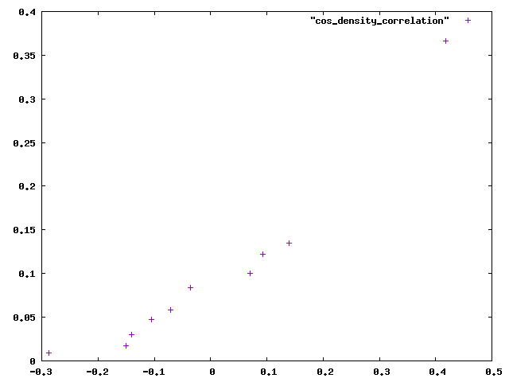

There is a definite correlation, but it isn't linear or particularly
obvious what the quantitative relationship is (particularly with this
small dataset).

A closely related but perhaps more natural quantity that is similarly
correlated is simply the distance between alpha*a_n and the middle of
the interval [0,2pi], i.e.: `|(alpha*a_n mod 2pi) - pi|`:

```
2.001302345410207     .36586481295161437848
1.7104354622693787    .13528028722710584059
1.6640810135019244    .12178131971980553958
1.6409037891182088    .09999200063994880409
1.5354547010472182    .08366800535475234270
1.499537286127282     .05875578744506333873
1.4659230278960003    .04720499239999622360
1.4300056129761636    .02992470943107142429
1.4195685791285513    .01732768912739490323
1.2792808257332915    .00886226271291586167
```

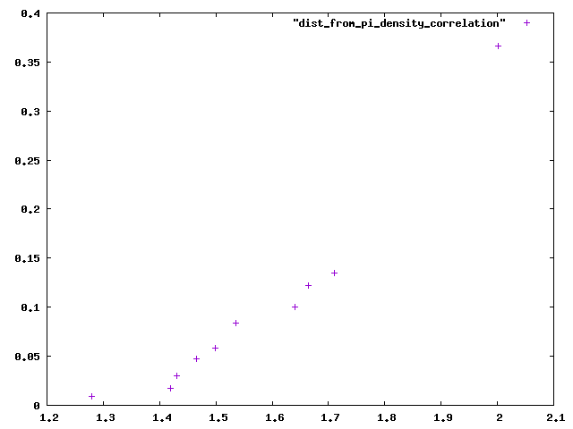

Still nothing particular earth-shatteringly obvious.  sqrt(density)
looks a little more like a line, but not hugely convincingly.

We note that the two closest terms to the middle of \[0,2pi\] are 11 and
10833.  Even though these are very much outside of the two main bulges
in the distribution that go from about 2.1-3.0 and 3.2-4.2, they still
show up rarely as summands.  For a striking visualisation of the
frequency of things as summands, see [this
file](data/ax_by_dist_from_pi).

### 20160101 Large summands

We've studied the smaller summands a bit--now the question is: What
about the large summands?

We note first that if 2 or 3 is the small summand of `a_{n+1}`, then
the large summand is necesarily `a_n` (if 2 is the small summand and
`a_n` is not the large summand, then `a_{n+1}` would be `a_n + 1`
which is impossible since this is a duplicate sum with `a_n+a_1`.  If
3 is the small summand and `a_n` is not the large summand, then
`a_{n+1}` is either `a_n + 1` or `a_n + 2`, both of which would be
duplicates.)

This means that over 50% of the time, the large summand will be the
last thing in the list so far.  When looking at the large summand,
then, it seems more relevant to consider how many indices from the end
it lives, rather than its actual value.  We compute these in
`experiment13`, generating output [here](data/indices_of_summands) of the form:

```
n 	a_n	i	n-j   (with a_i + a_j = a_n and i < j)
2 	1 	0 	1
3 	2 	0 	1
4 	3 	1 	1
5 	4 	1 	1
6 	6 	2 	1
7 	8 	1 	1
8 	11 	2 	1
9 	13 	1 	1
10 	16 	5 	1
11 	18 	1 	1
...
```

We can do some processing on these to figure out which n-j are the
most common:

```
cat data/indices_of_summands | cut -d ' ' -f 4 | sort -n|uniq -c|sort -n > data/n_minus_js
```

results [here](data/n_minus_js).  Note in particular that there are
only 159 of them and (as suggested above) that n-j = 1 accounts for
over 50% of them.  This list seems to contain few surprises: Among all
the values of n-j that appear more than 10 times, nothing bigger than
34 shows up.

If we look at values that show up fewer than 10 times, then it looks
like n-j = 100 and 185 < n-j < 205 seem to be preferred, with many of
these showing up 3 or more times, while all other values show up 2 or
fewer times.  This could be an artifact of not much data, however.

We might instead take a look instead at enumerating `(i,n-j)` pairs,
rather than just values of n-j:

```
cat data/indices_of_summands | cut -d ' ' -f 3,4 | sort -n|uniq -c|sort -n > data/i_nmj
```

with results [here](data/n_nmj).  Note in particular that there are
only 312 distinct such pairs, meaning that technically, to compute the
first 10000 Ulam numbers, we only have to check 312 possibilities for
each.  If only there were a way of knowing ahead of time which 312 we
had to check...

### 20160102 More data

Turns out the previous way of computing Ulam numbers was much slower
than it needed to be, as we can exchange a lot of the computation time
for space.

In particular, we can treat computing the sequence as a sieving
procedure in which we maintain three sets:

* Ulam numbers found thus far
* Numbers that are sums of two distinct Ulam numbers in a unique way
* Numbers that are sums of two distinct Ulam numbers in more than one way

At each stage, the next Ulam number is simply the smallest element of
the second set that is larger than the largest Ulam number found to
date.  In particular, we will want the first and second sets to be
ordered.

Further, if instead of storing just the Ulam numbers this computes, we
store all three sets, then we can easily resume the computation where
we left off.

This is implemented in `extend_with_storage_careful` and takes 50
minutes to compute the first 100000 Ulam numbers on my 7-year-old Core
2 Duo laptop.

The data needed to continue the computation is in
[seqs/raw/s100k](seqs/raw/s100k).

This means we can repeat a lot of the computations we did earlier with
10x more data.  For example, there are now 662 unique `(i,n-j)` pairs:

```
$ python test.py|awk '{print $4" "$5}'|sort -n | uniq -c | sort -n|wc -l
662
```

Interestingly, we also computed `a_{n+1}-a_n` for each n and found
that there are only 81 different values for this, ranging from 1 to
587.

```
  36935 2
  13695 3
   8572 17
   7689 20
   5354 25
   4975 12
   3855 22
   3401 15
   3294 42
   2174 39
   1199 34
   1191 8
   1169 5
    860 47
    683 30
    628 44
    544 56
    381 27
    348 69
    326 37
    304 61
    265 78
    227 7
    209 24
    184 52
    182 19
    160 64
    151 100
    136 41
    119 29
    114 10
     82 122
     73 86
     69 83
     65 66
     40 108
     33 91
     33 144
     28 73
     28 59
     22 32
     20 130
     18 166
     13 113
     13 105
     12 46
     11 49
     10 63
     10 218
     10 174
      9 196
      7 85
      7 152
      6 95
      6 139
      5 51
      4 68
      4 210
      3 9
      3 188
      3 127
      3 117
      3 1
      2 4
      2 205
      2 157
      2 135
      2 129
      1 71
      1 587
      1 337
      1 315
      1 262
      1 249
      1 240
      1 183
      1 181
      1 137
      1 13
      1 115
      1 107
```

### 20150102 Algebraicity

My guess is that since apparently alpha=pi sometimes, alpha should not
be expected to be algebraic, but really 2pi/alpha is the relevant
quantity anyways.  At any rate, we tried some tests on both using LLL
to hunt for the minimal polynomial of b = 2pi/alpha and b = alpha.  It
should be noted that f(b) << 10^(-10) is what is needed to be
convincing that f(b) is actually zero.  Also, I am not sure what
effect result from the lack of precision in our knowledge of alpha.

For what it's worth, then, here is the basic computation (done in
Sage):

```
from sage.libs.fplll.fplll import FP_LLL
b2=2.57144749848
b=N(2*pi/2.57144749848)

def find_mp(x,deg=50,n=10^10):
    M = []
    for i in range(deg+1):
        M.append([1 if v == i else 0 for v in range(deg+1)]+[int(n*(x^i)+.5)])
    M = matrix(M)
    F=FP_LLL(M)
    F.LLL()
    l=F._sage_()[0][:-1]

    R = ZZ['X']
    X=R.gen()
    fx = 0
    for i in range(len(l)):
        fx += X^i * l[i]
    ans = N(fx(x),50)
    return(fx, ans, fx.factor())

ms = [find_mp(b,i) for i in range(2,10)]
ms.sort(key=lambda x:abs(x[1]))
for x in ms:
    print(x)

print("")
ms = [find_mp(b2,i) for i in range(2,10)]
ms.sort(key=lambda x:abs(x[1]))
for x in ms:
    print(x)
    

(5*X^7 - 9*X^6 - 8*X^5 - 4*X^4 + 6*X^3 + 6*X^2 + 3*X + 24, -4.8860471224543e-11, 5*X^7 - 9*X^6 - 8*X^5 - 4*X^4 + 6*X^3 + 6*X^2 + 3*X + 24)
(-5*X^8 + 9*X^7 + 8*X^6 + 4*X^5 - 6*X^4 - 6*X^3 - 3*X^2 - 24*X, 1.1938777481609e-10, (-1) * X * (5*X^7 - 9*X^6 - 8*X^5 - 4*X^4 + 6*X^3 + 6*X^2 + 3*X + 24))
(22*X^5 - 27*X^4 - 47*X^3 - 22*X^2 - 49*X - 17, -6.4223470985780e-10, 22*X^5 - 27*X^4 - 47*X^3 - 22*X^2 - 49*X - 17)
(X^9 - 6*X^8 + 6*X^7 + 8*X^6 - 4*X^5 - X^4 + 5*X^3 + 6*X^2 - 12*X + 1, 1.3065359905085e-9, X^9 - 6*X^8 + 6*X^7 + 8*X^6 - 4*X^5 - X^4 + 5*X^3 + 6*X^2 - 12*X + 1)
(-4*X^6 - 10*X^5 + 39*X^4 + 24*X^3 + 2*X^2 - 18*X + 14, 2.0213413165493e-9, (-1) * (4*X^6 + 10*X^5 - 39*X^4 - 24*X^3 - 2*X^2 + 18*X - 14))
(-28*X^4 + 13*X^3 + 91*X^2 + 95*X + 33, 2.9011744118179e-9, (-1) * (28*X^4 - 13*X^3 - 91*X^2 - 95*X - 33))
(-25*X^3 + 62*X^2 + 123*X - 306, 3.7695372157032e-8, (-1) * (25*X^3 - 62*X^2 - 123*X + 306))\n(-509*X^2 + 947*X + 725, 2.5785948309931e-7, (-1) * (509*X^2 - 947*X - 725))

(X^8 - 11*X^5 - 13*X^4 - 9*X^3 + 8*X^2 - 6*X + 9, 1.8155628112027e-9, X^8 - 11*X^5 - 13*X^4 - 9*X^3 + 8*X^2 - 6*X + 9)
(X^8 - 11*X^5 - 13*X^4 - 9*X^3 + 8*X^2 - 6*X + 9, 1.8155628112027e-9, X^8 - 11*X^5 - 13*X^4 - 9*X^3 + 8*X^2 - 6*X + 9)
(X^6 + 6*X^5 - 22*X^4 + 7*X^3 + X^2 - 34*X - 40, -1.8250148059451e-9, X^6 + 6*X^5 - 22*X^4 + 7*X^3 + X^2 - 34*X - 40)
(-3*X^7 + 3*X^6 + 15*X^5 + 2*X^4 - 21*X^3 - 4*X^2 - 13*X + 6, -2.3348913913424e-9, (-1) * (3*X^7 - 3*X^6 - 15*X^5 - 2*X^4 + 21*X^3 + 4*X^2 + 13*X - 6))
(27*X^4 - 92*X^3 + 40*X^2 + 25*X + 55, 3.9355683156828e-9, 27*X^4 - 92*X^3 + 40*X^2 + 25*X + 55)
(3*X^5 + 22*X^4 - 54*X^3 - 32*X^2 - 55*X - 28, 6.7800982606059e-9, 3*X^5 + 22*X^4 - 54*X^3 - 32*X^2 - 55*X - 28)
(-49*X^2 + 252*X - 324, -1.7553418274474e-8, (-1) * (7*X - 18)^2)
(-49*X^2 + 252*X - 324, -1.7553418274474e-8, (-1) * (7*X - 18)^2)
```

