### The problem:

The Ulam numbers are defined by a_1 = 1, a_2 = 2, and for n > 2, a_n
is the smallest integer that can be written in a unique way as a sum
of two distinct a_i for i < n.

In particular, this means that to compute a_n, one needs to consider
information from all preceeding a_i, which makes the a_n apparently
quite difficult to describe cleanly.  In principle, one could
reasonably hope to think of the a_n as random in some way.

In a recent [paper](http://arxiv.org/abs/1507.00267), Stefan
Steinerberger found that if one Fourier transforms the indicator
function of the a_n on the positive integers, there is a visible peak
at a specific frequency.  Looking at a large number of a_n modulo this
frequency, the distribution that is observed appears to converge to
something continuous and non-uniform.

This repository contains assorted computations and calculations
exploring that distribution.

### Interesting takeaways so far:

* [link](#20160102-what-are-the-peaks) For any given a_i that shows up
  often as a summand of future a_n, the distribution of the other
  summand a_n - a_i (as always, mod 2pi/alpha) seems to always be a
  simple distribution (maybe a binomial distribution?), rather than
  the sort of "peak with some noise" in the simple picture.

* [link](#20160219-no-ulam-numbers-near-nlambda) It seems,
  appropriately understood, that the largest peak in the Fourier
  transform does control the number of representations of any given x
  as a+b for Ulam a and b, for x in the [0,lambda/6] or
  [5lambda/6,lambda]

* [link](#20160307-circle-method) Being an Ulam number is a feature of
  having no more than three representations as x+y for x, y Ulam
  numbers.  Counting these representations using knowledge of the
  Fourier coefficients is what the "circle method" was born to do, so
  we can try to apply this technique to the Ulam sequence.
  Empirically, this appears to be justified (the two "major arcs"
  dominate), but they do not dominate in absolute value.
  
* [link](#20160317-some-identities) Any time we can count the
  solutions to a linear Diophantine equation in the set of Ulam
  numbers, we can write down a corresponding equality on the Fourier
  side that should help constrain what the coefficients can be.  In
  particular, enough of these may force the behaviour of "a single
  large Fourier coefficient".

* [link](#20160330-d-ulam-numbers) If we make some optimistic
  assumptions about the sizes of the major and minor arcs, we can
  outline what should eventually turn into a proof that Ulam numbers
  have no "far outliers" and finitely many "near outliers",
  appropriately understood.

* [link](#20160330-how-major-are-the-major-arcs) Our assumptions about
  the major and minor arcs are not literally true, mostly because
  there appear to be more "major" arcs than expected.  These seem to
  come at small integer multiples of the largest one, however, so we
  may have some hope of understanding them.

### All takeaways:

* [link](#20151220-more-alphas) Possibly alpha_(x,x+1) = pi for x that are >= 12 and are even

* [link](#20151220-more-alphas) Possibly alpha_(1,x) -> 0 as x -> infinity

* [link](#20151220-linearity-of-f_n-in-n) With `f_N(x)` the fourier
  transform of the indicator function of `a_n` up to N (as in
  Steinerberger's sense), `f_N(alpha)` grows linearly in N.

* [link](#20151221-continued-fractions) The a_i are very unusually
  biased mod 540, and generally are biased modulo the denominators of
  the continued fraction convergents of alpha

* [link](#20151221-continued-fractions) In general, if we're imagining `alpha = 2pi*k/m` (where k
  is related to the set of favoured congruence classes mod m), then
  there are several available choices for k but only one that gives
  the apparent continuity observed.  For example, `10839*alpha mod 2pi
  = 5.9926...` works about as well as alpha for giving a peak in the
  Fourier transform.

* [link](#20151229-subgroup-considerations) Whatever is going on is
  not purely algebraic.

* [link](#20151230-evolving-a-distribution) Whatever is going on is
  not a result of something that can be simulated by a simple random
  process.

* [link](#20151230-a-correlation-between-summands-and-cosalphaa_n) How
  likely a_n is to be used as a summand of a later a_i is not at all
  random, but appears instead to be correlated with the value of
  cos(alpha*a_n)

* [link](#20151231-frequency-of-a_n-as-a-summand-revisited) The set of
  i for which a_n appears as a summand appears to have fixed density,
  whose numerical value is somehow correlated with `cos(alpha*a_n)`
  (or, perhaps equivalently but more simply, with the distance between
  `alpha*a_n mod 2pi` and pi.

* [link](#20160101-large-summands) Each `a_n` can be written in a unique was as `a_i + a_j`.  In the
  first 10000 a_n, there are only 312 unique pairs `(i, n-j)`.

* [link](#20160102-more-data) Each `a_n` can be written in a unique
  was as `a_i + a_j`.  In the first 100000 a_n, there are only 662
  unique pairs `(i, n-j)`.
  
* [link](#20160102-what-are-the-peaks) For any given a_i that shows up
  often as a summand of future a_n, the distribution of the other
  summand a_n - a_i (as always, mod 2pi/alpha) seems to always be a
  simple distribution (maybe a binomial distribution?), rather than
  the sort of "peak with some noise" in the simple picture.

* [link](#20160127-ulam-factorisations) Each Ulam number can be split
  uniquely into a sum of smaller ones.  We can repeat this process
  until we break every Ulam number into a sum of 1s and 2s.  When we
  do this, we seem to get about 38% 1s and 62% 2s.
  
* [link](#20160229-modified-ulam-numbers) It probably doesn't matter
  whether we define the Ulam numbers as "those expressible uniquely as
  sums of pairs of distinct smaller Ulam numbers" or whether we drop
  "distinct" from this definition.

* [link](#20160302-non-ulam-numbers) There are numbers that are not
  sums of two Ulam numbers.  Mod lambda, these live only in the middle
  2/3.  In particular, the reason for anything in [0,lambda/6] or
  [5lambda/6,lambda] to not be Ulam is that they all have more than 1
  representation as a sum of Ulam numbers.

* [link](#20160219-no-ulam-numbers-near-nlambda) It seems,
  appropriately understood, that the largest peak in the Fourier
  transform does control the number of representations of any given x
  as a+b for Ulam a and b, for x in the [0,lambda/6] or
  [5lambda/6,lambda]

* [link](#20160307-circle-method) Being an Ulam number is a feature of
  having no more than three representations as x+y for x, y Ulam
  numbers.  Counting these representations using knowledge of the
  Fourier coefficients is what the "circle method" was born to do, so
  we can try to apply this technique to the Ulam sequence.
  Empirically, this appears to be justified (the two "major arcs"
  dominate), but they do not dominate in absolute value.
  
* [link](#20160317-some-identities) Any time we can count the
  solutions to a linear Diophantine equation in the set of Ulam
  numbers, we can write down a corresponding equality on the Fourier
  side that should help constrain what the coefficients can be.  In
  particular, enough of these may force the behaviour of "a single
  large Fourier coefficient".

* [link](#20160330-d-ulam-numbers) If we make some optimistic
  assumptions about the sizes of the major and minor arcs, we can
  outline what should eventually turn into a proof that Ulam numbers
  have no "far outliers" and finitely many "near outliers",
  appropriately understood.

* [link](#20160330-how-major-are-the-major-arcs) Our assumptions about
  the major and minor arcs are not literally true, mostly because
  there appear to be more "major" arcs than expected.  These seem to
  come at small integer multiples of the largest one, however, so we
  may have some hope of understanding them.
  
### Questions

* What is alpha?

* What do the peaks mean in the distribution of a_n mod 2pi/alpha?

### 20151220 More alphas

We compute these in `experiment1` and `experiment2`

```
Format: a1 a2 (optimal alpha, approximated to four decimal places, ||F_200||^2 (only meaningful if orders of magnitude bigger than 200))

1 2 (2.571600000001008, 23348.35938929195)
1 3 (2.8334000000015607, 24293.720371257674)
1 4 (2.094400000000001, 39007.46385460891)
1 5 (1.7648999999998278, 26597.042612213307)
1 6 (4.833200000002081, 32338.778040479963)
1 7 (0.32669999999998606, 24192.1315190365)
1 8 (0.2736999999999919, 25928.99448125898)
1 9 (6.038099999999273, 26372.972667249553)
1 10 (6.061699999999218, 25717.807140737834)
1 11 (6.083299999999167, 25743.731352831754)
1 12 (6.101599999999125, 25737.80981551202)
1 13 (6.115499999999092, 25926.87112676625)
1 14 (6.124499999999071, 25983.886809829368)
1 15 (6.135699999999045, 25647.874299833387)
1 16 (6.1453999999990225, 26048.466535913547)
1 17 (6.155099999999, 26086.336559974516)
1 18 (6.158099999998993, 26167.0885135168)
1 19 (6.166099999998974, 26600.041630256266)
1 20 (6.174099999998956, 25678.082435323184)
1 2 (2.571600000001008, 23348.35938929195)
2 3 (1.1841999999998918, 16192.09475962663)
3 4 (5.380900000000804, 26414.80301587582)
4 5 (5.600000000000294, 21640.564248470706)
5 6 (2.0588999999999262, 22783.571558654858)
6 7 (2.6889000000012557, 19502.053865731123)
7 8 (3.9426000000039014, 23910.35721534735)
8 9 (3.490300000002947, 19172.229899792306)
9 10 (5.955799999999464, 13422.672633312626)
10 11 (3.4270000000028134, 17537.29505082042)
11 12 (6.00919999999934, 14069.21195102112)
12 13 (3.141600000002211, 17955.65635464096)
13 14 (2.9106000000017236, 18768.829084251494)
14 15 (3.141600000002211, 19043.701112532486)
15 16 (2.940100000001786, 15916.092915960573)
16 17 (3.141600000002211, 23103.745481433194)
17 18 (2.963400000001835, 17551.757008092867)
18 19 (3.141600000002211, 21903.769889105457)
19 20 (6.123199999999074, 15870.335860431833)
```

So for example, when a1 = 12, a2 = 13, it looks like alpha = pi, which
seems to be confirmed for this particular instance by computing more
terms and searching with more precision.  This is saying that the a_i
are very biased mod 2pi/pi = 2, which seems experimentally to be very
much the case even out to thousands of terms (for this particular
example): the a_i are over 80% odd.  Proving something in this
direction seems accessible, but some first efforts were unfruitful.


### 20151220 Linearity of f_N in N

If we plot `g(N) = f_N(alpha)/N = ||sum_{n=1 to N} exp(i*alpha*a_n)||/N`
as a function of N, (done in `experiment0`) we get the following plot:

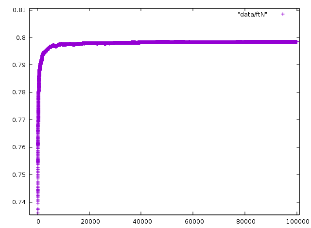

We see that this quantity seems to approach 0.8 from below, and while
it is not monotonically increasing, it is close.  This looks like it
might be `0.8-N^{-a}` for some n.  To get an idea for this, we look at
a plot of `log(0.8-f_N(alpha)/N)/log(N)`:

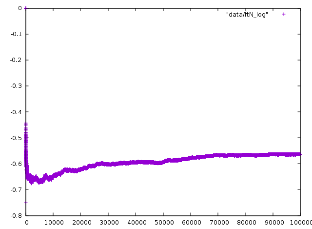

We note by looking at the [data](data/ftN_log) that this seems to be
approaching -0.56....  So this suggests that `f_N(alpha) = 0.8N - c*N^(0.44...)`

At any rate, we know that f_N(alpha) <= N, so it can't very secretly
be growing just barely faster than linear (NlogloglogN or something).
So we conclude that very likely, in fact f_N(alpha) is about 0.8N, as
Steinerberger also mentions.

What sort of phenomenon gives rise to this?  Note for example that in
the extreme case where a_i = r mod m for all i, |f_N(2pi/m)| will be N
on the nose.  If instead a_i is only ever congruent to r or s mod m,
then if k = 1/(r-s) mod m, then again |f_N(2pi*k/m)| is close to N.

In general, one could imagine that for whatever initial values, the
existence of such alpha is saying the a_i prefer a set of congruence
classes mod m for some (possibly large) m.  In this case, alpha could
be `2pi*k/m` for some k.  (To see what k is, think what happens if the
a_i happen to biased toward only two congruence classes r and s modulo
m, then k would be such that kr and ks are all as close as possible
mod m, say k = 1/(s-r) mod m.  If the preference is for more than two
congruence classes, then the choice of k seems complicated (though
still elementary): Given r1, ... rM mod m, find the k such that the
`k*r_i` are all "as tightly clustered as possible".  There could be
multiple k that do the job well, even if one of them is the very best.

### 20151221 Continued fractions

It is more likely that there is a sequence of m mod which the
congruence classes of a_i are increasingly clustered.  The continued
fraction of 2pi/alpha, which we're imagining is m/k, doesn't have some
really large coefficient where we would obviously truncate it.
Instead, for 2pi/alpha_(1,2) it is just

```[2; 2, 3, 1, 11, 1, 1, 4, 1, 1, 7, 2, 2, 6, 5, 3, 1, 3, 1, 2, 1, 3, 2, 1, 14, 2, 5, 3, 2, 3, 1, 2, 13, 2]```

(For most of the alpha(i,j) that we computed to any meaningful
precision, either this "not obviously a rational number" continues to
be true, except when there is a very small obvious modulus like 2.)

This gives rational approximations: 

```
5/2
17/7
22/9
259/106
281/115
540/221
2441/999
2981/1220
5422/2219
40935/16753
87292/35725
215519/88203
1380406/564943
7117549/2912918
22733053/9303697
29850602/12216615
112284859/45953542
142135461/58170157
396555781/162293856
538691242/220464013
2012629507/823685895
4563950256/1867835803
6576579763/2691521698
96636066938/39549139575
199848713639/81789800848
1095879635133/448498143815
3487487619038/1427284232293
8070854873209/3303066608401
27700052238665/11336484057496
35770907111874/14639550665897
99241866462413/40615585389290
1325915171123243/542642160726667
```

These suggest, for example, that for m = 540, there should be
substantial bias in which congruence classes show up in the Ulam
sequence.

This is borne out in very crude measurement by taking the first 10000
(now: 100000) terms of the Ulam sequence and computing them mod,
e.g. 540, and asking how often each confruence class mod 540 shows up
and computing the standard deviation of all these numbers.

For the first few moduli coming from the convergents of the confinued
fraction, we get:

```
5 139.9757121789348
17 263.62138626089813
22 298.6996058675916
259 341.73231186554915
281 274.8670335289345
540 664.2715810068448
2441 3022.3025069077416
2981 3009.780526078754
5422 2580.6984215609386
40935 970.8607009744287
87292 690.3748130781282
215519 482.8027781782595
1380406 304.5611017423058
```

Note, however, that while it looks like the bias starts falling off at
40935, in fact we only know alpha to within 10^(-10) or so, and for
p/q convergents from the continued fraction, |alpha - p/q| < 1/q^2.
So being confident about alpha to within 10^(-10) suggests that we
should only trust convergents up to 5-6 digits.

Moreover, we note that if we take fewer terms, then fewer of the terms
will be less than the modulus, so we may see less of the bias even if
there is some.  For example, the same calculation with only the first
10000 terms looks like:

```
5 21.633307652783937
17 61.68515885956209
22 72.60478321332931
259 89.57462754381896
281 193.62880436289325
540 682.2864609640275
2441 382.62668898244124
2981 348.9472882781135
5422 263.99360062887
40935 122.81328398767178
87292 105.0829179694691
215519 97.65246431214172
1380406 99.63712935143478
```

Also of note is that if we repeat the computation with N=100000 with
other random moduli, then we don't see numbers of that magnitude at
all:

```
530 259.81675690726956
531 268.71357064883694
532 260.1569364421163
533 255.68231196723025
534 266.62552117028446
535 271.33290240078446
536 254.8672320447439
537 252.96083561994615
538 266.52186279126255
539 255.35109519675422
540 664.2715810068448
541 258.6315258698218
542 263.9800814357665
543 245.40391780272816
544 248.46681338348031
545 248.57633534874722
546 260.8123404347978
547 257.8431350005471
548 259.2776180307103
549 266.2013289617154
2430 303.14196649730286
2431 253.30600410441076
2432 253.86890201025946
2433 257.71596117841796
2434 255.44123618514527
2435 259.8991085246571
2436 257.7740924891793
2437 249.03420505884276
2438 254.54509601734742
2439 264.9962194257936
2440 255.43572224088751
2441 3022.3025069077416
2442 258.0622079927702
2443 255.08506362547774
2444 258.5368531157321
2445 251.56480095544921
2446 264.22911525323224
2447 247.80200745731952
2448 256.7669749242785
2449 260.62877921543617
```

One takeaway from this study of increasing moduli is the following:
earlier we discussed the possibility of the behaviour indicting bias
mod some m.  In fact, there may not be a single m with the most bias,
but an increasing sequence of m's with progressively more bias.  For
example, one could imagine a sequence that is slightly biased to being
odd, say 60% are 1 mod 2.  But then in fact it turns out that mod 4,
it is more strongly biased, with 65% being only 2 or 3 mod 4.  And
maybe in fact mod 12, 80% of terms are only ever 2, 3, 6, or 8 mod 12,
and maybe in fact 99% are 2, 3, 6, 8, or 1 mod 48, and maybe you can
catch more and more of the sequence with a slowly expanding set of
congruence classes modulo quickly growing modulus.  If there is a
"bias mod m" thing happening, this is probably the flavour it takes,
but I'm happy to try to treat the approximation to alpha as indicating
an "at least some bias toward some congruence classes mod some fixed
m" phenomenon.

### 20151229 Subgroup considerations

One possible source of bias mod 540 (say) would be if a_n tended to
miss certain whole subgroups mod 540.  This seems kind of attractive
based on the fact that 540 has a lot of divisors (though this isn't
always true of the other denominators in the continued fraction
expansion) and so Z/540 has many subgroups.  If, for example, at some
point it turned out that all the elements of the sequence were a fixed
list of subgroups mod 540, then because to generate future elements
all we do is add previous elements, we could only ever climb the
subgroup lattice and might continue to miss subgroups not containing
the ones we've seen.

Of course, this idea as stated is a non-starter because a_1 = 1
generates the whole group.  However, in the first 10000 terms, 1 only
shows up as a summand as 2+1, 3+1, and 47+1 and then never again, so
maybe some approximate version of this is true.

We compute using `experiment9`: 


```
Format: divisor of 540, number of a_n in that subgroup, number of integers 1..10000 in that subgroup
1 : 2625 =? 2666
2 : 1342 =? 1333
3 : 916 =? 888
4 : 1351 =? 1333
5 : 667 =? 666
6 : 443 =? 444
9 : 289 =? 296
10 : 346 =? 333
12 : 416 =? 444
15 : 228 =? 222
18 : 170 =? 148
20 : 334 =? 333
27 : 187 =? 148
30 : 104 =? 111
36 : 126 =? 148
45 : 90 =? 74
54 : 31 =? 74
60 : 104 =? 111
90 : 0 =? 37
108 : 89 =? 74
135 : 1 =? 37
180 : 75 =? 37
270 : 66 =? 18
540 : 0 =? 18
```

Notably, for 540, everything seems to show up about as often as
predicted except for 90, 135, and 540, which, surprisingly, show up
basically never.

We note that the absence of 90 is truly a "mod 540" phenomenon, since
mod 270, say, the elements that generate the subgroup generated by 180
mod 540 will be in the subgroup generated by 90 by 270, so we will get
about the expected number of these.  However, 135 is still absent mod
270.

This phenomenon is not really strong enough to account for the
substantial bias observed, however, and nor does it happen uniformly
among denominators of the continued fraction.  For 259, we observe: 

```
1 : 8381 =? 8339
7 : 1360 =? 1389
37 : 216 =? 231
259 : 43 =? 38
```

```
1 : 9051 =? 9057
11 : 909 =? 905
271 : 40 =? 33
2981 : 0 =? 3
```

```
1 : 4934 =? 4932
2 : 2468 =? 2466
4 : 2470 =? 2466
139 : 36 =? 35
157 : 33 =? 31
278 : 15 =? 17
314 : 19 =? 15
556 : 13 =? 17
628 : 12 =? 15
21823 : 0 =? 0
43646 : 0 =? 0
87292 : 0 =? 0
```

So why it is exactly that 90 and 135 never show up mod 540 is unclear,
but this could be random (they never showed up to begin with, and so
are unlikely to show up in future) and this isn't the cause of the
bias, most likely.

It is perhaps not terribly surprising that this isn't the answer:
clustering into two peaks mod 540 is not a particularly
algebraic-sounding phenomenon.

### 20151230 Evolving a distribution

Another possible source of the bias mod 540 is that some level of bias
simply happens by accident for a_i < 540 (maybe it is expected for at
least some modulus) and then, once you have this distribution, making
the next element of the sequence by picking two elements randomly from
this distribution (e.g. around 249 and 349 are the two peaks mod 540,
so maybe it's likely to pick e.g. 249 + 349 for the next congruence
class).

Under this assumption, we can evolve the distribution which starts
(using the first 10000 elements) like:


and, under this evolution, gets smeared out to: 


Also unsurprising, but at least worth checking.

### 20151230 A correlation between summands and `cos(alpha*a_n)`

We note with interest the observation in the abstract of Steinerberger
that `cos(alpha*a_n) < 0` for all a_n other than 2, 3, 47, and 69.  In
particular, thee were also the a_n that showed up most frequently as
summands in our earlier computation.

So we compute which how often each a_n appears as the smaller summand
of a later a_i and we compute `cos(alpha*a_n)` for each and sort by
this quantity.  We note what looks like a very strong correlation
between how often a_n shows up as a summand and cos(alpha*a_n) in the
resulting table, computed by `experiment11`:

```
Format: a_n, # a_i such that a_n is the smaller summand of a_i, cos(alpha_{1,2} * a_n) [a_i : a_i = a_n + a_*]

2 3630 0.41733070262870486 [6, 8, 13, 18, 28, 38, 99, 177, 182, 221, 238, ...
3 1356 0.13918577174048308 [11, 16, 72, 102, 148, 180, 209, 241, 319, 412, ...
47 1190 0.09314945116148635 [236, 253, 356, 363, 429, 456, 544, 720, 732, ...
69 999 0.07005004608158771 [175, 258, 451, 483, 566, 820, 1018, 1052, 1101, ...
102 836 -0.03533426907901862 [282, 441, 502, 585, 624, 646, 668, 949, 1125, ...
339 589 -0.0711987488469575 [695, 739, 751, 861, 905, 1186, 1230, 1770, 1853, ...
36 465 -0.10468116468523993 [138, 309, 602, 927, 1191, 1550, 1682, 2090, 2288, ...
273 305 -0.1403260484112354 [612, 673, 685, 1164, 1296, 1308, 1428, 1660, 1765, ...
8 181 -0.15065198092326257 [26, 36, 77, 114, 197, 324, 390, 991, 1470, 1602, ...
2581 85 -0.28740411578013597 [5795, 7459, 8947, 9443, 9619, 9641, 9663, 10677, ...
400 55 -0.2884371848720607 [3214, 3605, 3991, 12763, 13562, 13799, 13931, 15160, ...
983 50 -0.3160870169407304 [2445, 2748, 5514, 9553, 16121, 17135, 19427, 21626, ...
97 47 -0.3204537967301412 [316, 370, 497, 1252, 2581, 3622, 4057, 10366, 13628, ...
356 21 -0.33249578951071784 [983, 4118, 11226, 22676, 27817, 34104, 34969, 52789, ...
1155 16 -0.34664508490498336 [4878, 9132, 13733, 16047, 27883, 30886, 38920, 40931, ...
206 33 -0.35210835605364843 [522, 891, 1155, 1514, 2787, 4324, 9399, 11432, 20375, ...
53 35 -0.36400375717687433 [155, 409, 1208, 3038, 5049, 8421, 14945, 16648, 19480, ...
1308 18 -0.3694282571996273 [3029, 8368, 10501, 20937, 29147, 34784, 37765, 61029, ...
9193 8 -0.39212546438962775 [20419, 68914, 74099, 83323, 92073, 108317, 123718, 124864]
10831 4 -0.4275703245958347 [31878, 56503, 89101, 126493]
13 6 -0.4278336499870973 [82, 219, 273, 19642, 59734, 91748]
14892 2 -0.43270258250883076 [41620, 84500]
13531 3 -0.4379518060471682 [47279, 61451, 83139]
23883 2 -0.4409365382548865 [65740, 106394]
10269 1 -0.4463455890816818 [44816]
8368 1 -0.4494994835242297 [20968]
20643 0 -0.45329707066551345 []
316 5 -0.4579687420768522 [2897, 9509, 37809, 44377, 45132]
30315 1 -0.4603261098428447 [64928]
3205 1 -0.46097252485489365 [89057]
56437 0 -0.4623937767448221 []
4118 0 -0.46422907716529205 []
10247 0 -0.46696423929912617 []
3038 2 -0.4683040193517334 [7156, 95616]
57 3 -0.46925689465650167 [126, 339, 9250]
483 1 -0.4712894777269175 [80891]
60665 0 -0.4719075620475581 []
63646 0 -0.47285836474034365 []
39912 1 -0.4732674578528013 [128969]
1023 3 -0.47331956082924576 [2178, 20643, 65705]
69608 0 -0.4747583182234548 []
47920 0 -0.4752710197227344 []
123683 0 -0.47626799121658503 []
33274 1 -0.48172182638061584 [97956]
11586 0 -0.4822323173406816 []
75706 0 -0.482256288588461 []
128969 0 -0.48251534075104174 []
3723 1 -0.4834321003782536 [34038]
39653 1 -0.484451819395134 [84469]
42217 0 -0.484555301907165 []
```

If nothing else, this might suggest to us how to compute more a_n more
quickly: Rather than searching previous summands in order, search in
the order given by using cos(alpha*a_n) as the index.  Once we find a
sum that is unique, we only have to search all smaller sums, again in
this order.  This isn't easy, but 

## 20151231 Experiment 7, revisited

`experiment7` now uses a new (hopefully more refined) method for
computing alpha for various sequences and gives, after about a 5
minute computation for each:

```
1,2 (2.5714479999999997, 1586.3495100297046)
1,3 (2.8334960000000002, 1587.3716251000853)
2,3 (1.184224, 1497.1305405102953)
12,13 (3.141592, 1847.9732996138823)
```

We note that alpha_{2,3} is different from that in Steinerberger.
Unclear whether this is a programming error or another peak or what.

### 20151231 Frequency of a_n as a small summand, revisited

We run `experiment11(u1_2, alpha1_2)` to compute 

```
python test.py | grep '^2 ' | sed 's/.*[[]//;s/]//;s/, /\n/g'|nl -ba > ss2
python test.py | grep '^3 ' | sed 's/.*[[]//;s/]//;s/, /\n/g'|nl -ba > ss3
```

The data for i such that a_i = 2 + a_n (some n) is plotted here: 


and for the a_i with 3, 47, 69, etc. as summands:


Looks quite linear.  Indeed, computing the lines of best fit like:

```
gnuplot> f(x) = a*x+b
gnuplot> fit f(x) "data/ss2" u 1:2 via a,b
```

we get:

```
a_n   line of best fit      density of i with a_n a summand of a_i
=================================================================
2:    2.73325 x + 89.98     .36586481295161437848
3:    7.39206 x - 68.4331   .13528028722710584059
47:   8.21144 x + 103.419   .12178131971980553958
69:   10.0008 x + 130.561   .09999200063994880409
102:  11.9520 x + 16.9218   .08366800535475234270
339:  17.0196 x - 58.678    .05875578744506333873
36:   21.1842 x + 117.105   .04720499239999622360
273:  33.4172 x - 5.79674   .02992470943107142429
8:    57.7111 x - 229.248   .01732768912739490323
2581: 112.838 x - 415.223   .00886226271291586167
```

One thing that we see from the later plots, e.g.


is that the graph seems to oscillate around the line of best fit.  To
this end, we take a few of these and subtract the lines of best fit to
see if we get something particularly striking:


Unclear...

We can also take these densities against the values of cos(alpha*x)
and plot them:

```
0.41733070262870486    .36586481295161437848
0.13918577174048308    .13528028722710584059
0.09314945116148635    .12178131971980553958
0.07005004608158771    .09999200063994880409
-0.03533426907901862   .08366800535475234270
-0.0711987488469575    .05875578744506333873
-0.10468116468523993   .04720499239999622360
-0.1403260484112354    .02992470943107142429
-0.15065198092326257   .01732768912739490323
-0.28740411578013597   .00886226271291586167
```


There is a definite correlation, but it isn't linear or particularly
obvious what the quantitative relationship is (particularly with this
small dataset).

A closely related but perhaps more natural quantity that is similarly
correlated is simply the distance between `alpha*a_n` and the middle
of the interval [0,2pi], i.e.: `|(alpha*a_n mod 2pi) - pi|`:

```
2.001302345410207     .36586481295161437848
1.7104354622693787    .13528028722710584059
1.6640810135019244    .12178131971980553958
1.6409037891182088    .09999200063994880409
1.5354547010472182    .08366800535475234270
1.499537286127282     .05875578744506333873
1.4659230278960003    .04720499239999622360
1.4300056129761636    .02992470943107142429
1.4195685791285513    .01732768912739490323
1.2792808257332915    .00886226271291586167
```


Still nothing particular earth-shatteringly obvious.  sqrt(density)
looks a little more like a line, but not hugely convincingly.

We note that the two closest terms to the middle of \[0,2pi\] are 11 and
10833.  Even though these are very much outside of the two main bulges
in the distribution that go from about 2.1-3.0 and 3.2-4.2, they still
show up rarely as summands.  For a striking visualisation of the
frequency of things as summands, see [this
file](data/ax_by_dist_from_pi).

### 20160101 Large summands

We've studied the smaller summands a bit--now the question is: What
about the large summands?

We note first that if 2 or 3 is the small summand of `a_{n+1}`, then
the large summand is necesarily `a_n` (if 2 is the small summand and
`a_n` is not the large summand, then `a_{n+1}` would be `a_n + 1`
which is impossible since this is a duplicate sum with `a_n+a_1`.  If
3 is the small summand and `a_n` is not the large summand, then
`a_{n+1}` is either `a_n + 1` or `a_n + 2`, both of which would be
duplicates.)

This means that over 50% of the time, the large summand will be the
last thing in the list so far.  When looking at the large summand,
then, it seems more relevant to consider how many indices from the end
it lives, rather than its actual value.  We compute these in
`experiment13`, generating output [here](data/indices_of_summands) of the form:

```
n 	a_n	i	n-j   (with a_i + a_j = a_n and i < j)
2 	1 	0 	1
3 	2 	0 	1
4 	3 	1 	1
5 	4 	1 	1
6 	6 	2 	1
7 	8 	1 	1
8 	11 	2 	1
9 	13 	1 	1
10 	16 	5 	1
11 	18 	1 	1
...
```

We can do some processing on these to figure out which n-j are the
most common:

```
cat data/indices_of_summands | cut -d ' ' -f 4 | sort -n|uniq -c|sort -n > data/n_minus_js
```

results [here](data/n_minus_js).  Note in particular that there are
only 159 of them and (as suggested above) that n-j = 1 accounts for
over 50% of them.  This list seems to contain few surprises: Among all
the values of n-j that appear more than 10 times, nothing bigger than
34 shows up.

If we look at values that show up fewer than 10 times, then it looks
like n-j = 100 and 185 < n-j < 205 seem to be preferred, with many of
these showing up 3 or more times, while all other values show up 2 or
fewer times.  This could be an artifact of not much data, however.

We might instead take a look instead at enumerating `(i,n-j)` pairs,
rather than just values of n-j:

```
cat data/indices_of_summands | cut -d ' ' -f 3,4 | sort -n|uniq -c|sort -n > data/i_nmj
```

with results [here](data/n_nmj).  Note in particular that there are
only 312 distinct such pairs, meaning that technically, to compute the
first 10000 Ulam numbers, we only have to check 312 possibilities for
each.  If only there were a way of knowing ahead of time which 312 we
had to check...

### 20160102 More data

Turns out the previous way of computing Ulam numbers was much slower
than it needed to be, as we can exchange a lot of the computation time
for space.

In particular, we can treat computing the sequence as a sieving
procedure in which we maintain three sets:

* Ulam numbers found thus far
* Numbers that are sums of two distinct Ulam numbers in a unique way
* Numbers that are sums of two distinct Ulam numbers in more than one way

At each stage, the next Ulam number is simply the smallest element of
the second set that is larger than the largest Ulam number found to
date.  In particular, we will want the first and second sets to be
ordered.

Further, if instead of storing just the Ulam numbers this computes, we
store all three sets, then we can easily resume the computation where
we left off.

This is implemented in `extend_with_storage_careful` and takes 50
minutes to compute the first 100000 Ulam numbers on my 7-year-old Core
2 Duo laptop.

The data needed to continue the computation is in
[seqs/raw/s100k](seqs/raw/s100k).

This means we can repeat a lot of the computations we did earlier with
10x more data.  For example, there are now 662 unique `(i,n-j)` pairs:

```
$ python test.py|awk '{print $4" "$5}'|sort -n | uniq -c | sort -n|wc -l
662
```

Interestingly, we also computed `a_{n+1}-a_n` for each n and found
that there are only 81 different values for this, ranging from 1 to
587.

```
  36935 2
  13695 3
   8572 17
   7689 20
   5354 25
   4975 12
   3855 22
   3401 15
   3294 42
   2174 39
   1199 34
   1191 8
   1169 5
    860 47
    683 30
    628 44
    544 56
    381 27
    348 69
    326 37
    304 61
    265 78
    227 7
    209 24
    184 52
    182 19
    160 64
    151 100
    136 41
    119 29
    114 10
     82 122
     73 86
     69 83
     65 66
     40 108
     33 91
     33 144
     28 73
     28 59
     22 32
     20 130
     18 166
     13 113
     13 105
     12 46
     11 49
     10 63
     10 218
     10 174
      9 196
      7 85
      7 152
      6 95
      6 139
      5 51
      4 68
      4 210
      3 9
      3 188
      3 127
      3 117
      3 1
      2 4
      2 205
      2 157
      2 135
      2 129
      1 71
      1 587
      1 337
      1 315
      1 262
      1 249
      1 240
      1 183
      1 181
      1 137
      1 13
      1 115
      1 107
```

### 20160102 Algebraicity

My guess is that since apparently alpha=pi sometimes, alpha should not
be expected to be algebraic, but really 2pi/alpha is the relevant
quantity anyways.  At any rate, we tried some tests on both using LLL
to hunt for the minimal polynomial of b = 2pi/alpha and b = alpha.  It
should be noted that f(b) << 10^(-10) is what is needed to be
convincing that f(b) is actually zero.  Also, I am not sure what
effects result from the lack of precision in our knowledge of alpha.

For what it's worth, then, here is the basic computation (done in
Sage):

```
from sage.libs.fplll.fplll import FP_LLL
b2=2.57144749848
b=N(2*pi/2.57144749848)

def find_mp(x,deg=50,n=10^10):
    M = []
    for i in range(deg+1):
        M.append([1 if v == i else 0 for v in range(deg+1)]+[int(n*(x^i)+.5)])
    M = matrix(M)
    F=FP_LLL(M)
    F.LLL()
    l=F._sage_()[0][:-1]

    R = ZZ['X']
    X=R.gen()
    fx = 0
    for i in range(len(l)):
        fx += X^i * l[i]
    ans = N(fx(x),50)
    return(fx, ans, fx.factor())

ms = [find_mp(b,i) for i in range(2,10)]
ms.sort(key=lambda x:abs(x[1]))
for x in ms:
    print(x)

print("")
ms = [find_mp(b2,i) for i in range(2,10)]
ms.sort(key=lambda x:abs(x[1]))
for x in ms:
    print(x)
    

(5*X^7 - 9*X^6 - 8*X^5 - 4*X^4 + 6*X^3 + 6*X^2 + 3*X + 24, -4.8860471224543e-11, 5*X^7 - 9*X^6 - 8*X^5 - 4*X^4 + 6*X^3 + 6*X^2 + 3*X + 24)
(-5*X^8 + 9*X^7 + 8*X^6 + 4*X^5 - 6*X^4 - 6*X^3 - 3*X^2 - 24*X, 1.1938777481609e-10, (-1) * X * (5*X^7 - 9*X^6 - 8*X^5 - 4*X^4 + 6*X^3 + 6*X^2 + 3*X + 24))
(22*X^5 - 27*X^4 - 47*X^3 - 22*X^2 - 49*X - 17, -6.4223470985780e-10, 22*X^5 - 27*X^4 - 47*X^3 - 22*X^2 - 49*X - 17)
(X^9 - 6*X^8 + 6*X^7 + 8*X^6 - 4*X^5 - X^4 + 5*X^3 + 6*X^2 - 12*X + 1, 1.3065359905085e-9, X^9 - 6*X^8 + 6*X^7 + 8*X^6 - 4*X^5 - X^4 + 5*X^3 + 6*X^2 - 12*X + 1)
(-4*X^6 - 10*X^5 + 39*X^4 + 24*X^3 + 2*X^2 - 18*X + 14, 2.0213413165493e-9, (-1) * (4*X^6 + 10*X^5 - 39*X^4 - 24*X^3 - 2*X^2 + 18*X - 14))
(-28*X^4 + 13*X^3 + 91*X^2 + 95*X + 33, 2.9011744118179e-9, (-1) * (28*X^4 - 13*X^3 - 91*X^2 - 95*X - 33))
(-25*X^3 + 62*X^2 + 123*X - 306, 3.7695372157032e-8, (-1) * (25*X^3 - 62*X^2 - 123*X + 306))\n(-509*X^2 + 947*X + 725, 2.5785948309931e-7, (-1) * (509*X^2 - 947*X - 725))

(X^8 - 11*X^5 - 13*X^4 - 9*X^3 + 8*X^2 - 6*X + 9, 1.8155628112027e-9, X^8 - 11*X^5 - 13*X^4 - 9*X^3 + 8*X^2 - 6*X + 9)
(X^8 - 11*X^5 - 13*X^4 - 9*X^3 + 8*X^2 - 6*X + 9, 1.8155628112027e-9, X^8 - 11*X^5 - 13*X^4 - 9*X^3 + 8*X^2 - 6*X + 9)
(X^6 + 6*X^5 - 22*X^4 + 7*X^3 + X^2 - 34*X - 40, -1.8250148059451e-9, X^6 + 6*X^5 - 22*X^4 + 7*X^3 + X^2 - 34*X - 40)
(-3*X^7 + 3*X^6 + 15*X^5 + 2*X^4 - 21*X^3 - 4*X^2 - 13*X + 6, -2.3348913913424e-9, (-1) * (3*X^7 - 3*X^6 - 15*X^5 - 2*X^4 + 21*X^3 + 4*X^2 + 13*X - 6))
(27*X^4 - 92*X^3 + 40*X^2 + 25*X + 55, 3.9355683156828e-9, 27*X^4 - 92*X^3 + 40*X^2 + 25*X + 55)
(3*X^5 + 22*X^4 - 54*X^3 - 32*X^2 - 55*X - 28, 6.7800982606059e-9, 3*X^5 + 22*X^4 - 54*X^3 - 32*X^2 - 55*X - 28)
(-49*X^2 + 252*X - 324, -1.7553418274474e-8, (-1) * (7*X - 18)^2)
(-49*X^2 + 252*X - 324, -1.7553418274474e-8, (-1) * (7*X - 18)^2)
```

All told, both look like they don't have small degree if algebraic at all...

### 20160102 What are the peaks?

In the cases Steinerberger looks at, the resulting non-uniform
distributions consist usually of multiple peaks.  In the case of the
1,2 Ulam sequence one of these peaks looks a little misshapen, so we
might reasonably wonder what each of these peaks actually is.

To get a handle on this, we take the Ulam sequence mod 5422, and
multiply it by 2219 (5422/2219 being a good rational approximation to
2pi/alpha).  Of course, this gives rise to the usual distribution
we've come to expect:

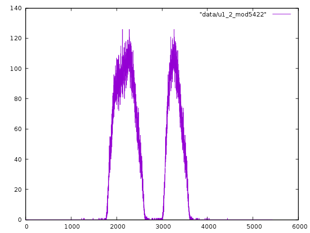

Supposing we look instead only at a_n's for which 2, say is a summand.  Then we get this nice picture:

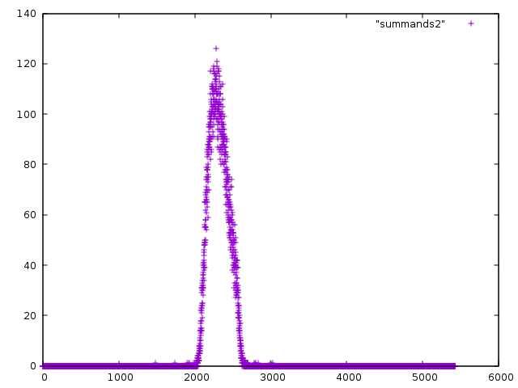

Likewise for 47:

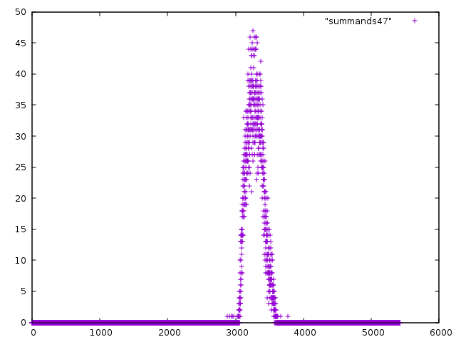

These are relatively clean-looking distributions, by comparison.  If
we plot these graphs for all of the top 25 most common summands all in
one picture, we notice that these seem to be the components of the two
observed peaks:

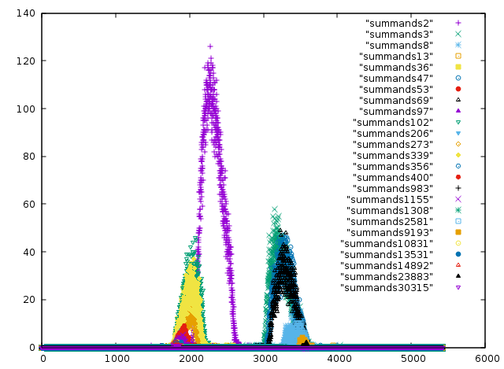

Since each of these seems to be instances of the same distribution
with different parameters, we might be interested in computing the
parameters of each, starting with the means.  We do this with a crunchy bash script

```
for x in `ls`; do y=$(echo $x|sed 's/summands//'); z=$(echo '('$(cat $x|sed 's/\([0-9]\)[ \t]\+\([0-9]\)/\1*\2/' | tr '\n' '+' | sed 's/+$//;s/[ \t]//g')')/'$(cat $x|awk '{x+=$2} END {print x}')|bc -l);  echo -e "$y\t$(((y*2219)%5422))\t$z"; done|sort -n -k 2
```

Which outputs the suqmmand `a_i`, the quantity `2219*a_i mod 5422`,
and the calculated mean of the distribution of `2219*a_n mod 5422` for
which `a_i` is a summand, we get:

```
3	1235	3241.07886089813800657174
47	1275	3288.00715563506261180679
69	1295	3300.94546174403642482430
8	1486	3431.55542168674698795180
2581	1607	3485.87893462469733656174
983	1633	3503.28070175438596491228
206	1666	3518.47580645161290322580
1308	1682	3525.95679012345679012345
9193	1703	3541.35227272727272727272
13	1737	3551.59183673469387755102
23883	1749	3572.53333333333333333333
30315	3653	1818.70000000000000000000
13531	3675	1827.60000000000000000000
14892	3680	1833.36363636363636363636
10831	3685	1845.62962962962962962962
53	3745	1872.41395348837209302325
1155	3761	1883.37745098039215686274
356	3774	1878.85087719298245614035
97	3785	1891.29746835443037974683
400	3814	1912.78585086042065009560
273	3945	1984.79197207678883071553
36	3976	1995.70821114369501466275
339	4005	2013.33377814845704753961
102	4036	2027.29907648591049017286
2	4438	2319.24248003248950859618
```

Staring at this for a minute, we notice that if we subtract the second
column from the third, we seen to get roughly 2000 for the first 11
entries (those on the right end of the distribution).  Likewise, those
on the left end (rows 12-25) seem to have a similar pattern.

One possible source for this is that the distribution we're taking the
mean of in the first row, say, is of `2219*a_n mod 5422` where 3 is a
summand of a_n in the Ulam sequence.  Since 3 is a summand of a_n in
the sequence, we might instead look at the other summand of a_n,
i.e. a_n - 3.  This would lead to us not plotting `2219*a_n mod 5422`,
but rather `2219*(a_n-3) mod 5422`.  We can compute these quickly with
another crunchy bash script:

```
cd data/summands2219,5422
mkdir shift
for x in summands*; do y=$(echo $x | sed 's/summands//'); cat $x | awk '{print ((($1-'$y'*2219)%5422)+5422)%5422" "$2}'|sort -n > shift/$x; done
```

And if we plot these, we get: 

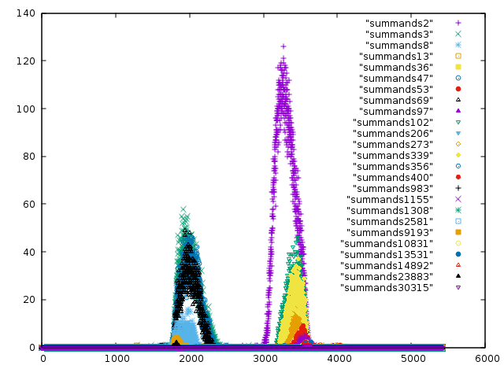

That's more like it.  Running the same mean computation as above on this, we get:

```
3    		1235	2006.07886089813800657174
47   		1275	2013.00715563506261180679
69   		1295	2005.94546174403642482430
8    		1486	1945.55542168674698795180
2581 		1607	1878.87893462469733656174
983  		1633	1870.28070175438596491228
206  		1666	1852.47580645161290322580
1308 		1682	1843.95679012345679012345
9193 		1703	1838.35227272727272727272
13   		1737	1814.59183673469387755102
23883		1749	1823.53333333333333333333
30315		3653	3587.70000000000000000000
13531		3675	3574.60000000000000000000
14892		3680	3575.36363636363636363636
10831		3685	3582.62962962962962962962
53  		3745	3549.41395348837209302325
1155 		3761	3544.37745098039215686274
356  		3774	3526.85087719298245614035
97   		3785	3528.29746835443037974683
400  		3814	3520.78585086042065009560
273  		3945	3461.79197207678883071553
36   		3976	3441.70821114369501466275
339  		4005	3430.33377814845704753961
102  		4036	3413.29907648591049017286
2    		4438	3303.24248003248950859618
```

We note also that the picture kind of suggests a binomial distribution
because of the variance that appears to grow as the mean gets closer
to the middle.

Indulging this hypothesis for just a moment, the actual graph (say for
a_i = 2 specifically), is measuting "for each congruence class, how
many complements of 2 in the sequence are in that congruence class?"
The idea that this graph is a binomial distribution would be saying
that we can perform 5422 independent trials (say one for each
congruence class?)  with identical success probabilities (one possible
such test is pick randomly from the 100000 a_ns in that congruence
class and ask whether 2 is ever a complement of that a_n), and the
proportion of times 2 shows up as a complement of k is equal to the
proportion of times we get exactly k successes in our trials.

### 20160104 Even more data

After 36 hours of computation on a more powerful computer using the
above (still relatively naive--not taking advantage of the summand
biases we have uncovered) algorithm, we have the first 10^6 Ulam
numbers in [seqs/seq1,2](seqs/seq1,2).  The raw data needed to
continue the computation is in `seqs/raw/s1m.gz`.

A few things to note:

From `experiment13`, there are now 1661 distinct `(i,n-j)`
complementary pairs.

Our crude measure of bias now favours 5422 as the modulus with the
most extreme bias (rerunning `experiment6`):

```
5 333.0003003001649
17 800.6146903179714
22 1030.8448432761795
259 760.5017851727679
281 874.8656470315152
540 1296.7354137731163
2441 2491.5036709586934
2981 5851.266028263648
5422 23762.002609084015
40935 9401.535274749083
87292 6472.813968180937
215519 4165.845328641447
1380406 1808.8909720773165
```

We also note that 540, formerly heavily biased, is not so much any
more.  Indeed, if we plot how many a_n are in each congruence class
mod 540 now, we get this plot:

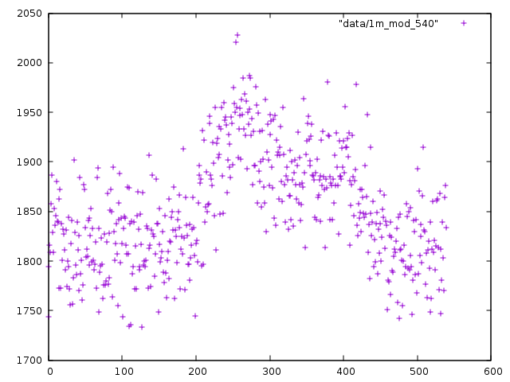

The two peaks are still visible, but they are now convincingly getting
washed out by the rest of the data.  This strongly suggests that to
view the phenomenon as a discrete one, we have to take the subtler
approach of "there is increasing bias mod m for a sequence of m".  I
still don't know how to reason about it as a continuous phenomenon.

### 20160106 Calculation error

Comparing the output to a computation by hand, it looks like the
earlier method used to compute the sequence for initial values 12, 13
was incorrect.  This has now been rectfied and the first 50000 have
been computed, and by all appearances, the sequence in fact has only
finitely many evens.  Specifically:

```
1:12
5:38
9:64
14:90
20:116
27:142
35:168
66:364
```

In particular, this would mean (by Finch) that the sequence of
consecutive differences is periodic.  So there is nothing more subtle
than regularity happening there after all.

### 20160106 Two Papers of Gibbs

I have found two papers of Philip Gibbs that seem to already contain
some of the observations here, heavily distilled:

* [A Conjecture for Ulam Sequences](http://vixra.org/pdf/1508.0045v2.pdf)
* [An Efficient Method for Computing Ulam Numbers](http://vixra.org/pdf/1508.0085v2.pdf)

The second describes an algorithm along the lines suggested above,
searching for summands starting with those on the edge of the interval
mod 2pi/alpha ("outliers", in the paper) (though it should be noted
that the paper predates the above observations).

The first conjectures a kind of quasi-regularity for Ulam numbers by
noting that the peaks are actually contained within the middle 1/3 of
the interval, with those outside being called "outliers".  In
particular, because the sum of any two elements in the middle third
lives outside the middle third, the statement that most elements live
in the middle third would require that most elements have an outlier
as a summand.

It is not clear that this conjecture alone requires the furthest
outliers to be more common summands than the near ones, but it
certainly sheds some light on the particular shape that appears.  At
any rate, it is neatly analogous to the "finitely many evens implies
regularity", conjecturing instead "finitely many in any open interval
excluding the middle third", and relating this to the
"quasi-regularity" observed by Steinerberger.

### 20160108 Understanding regularity

If we want to prove this kind of generalised regularity statement, it
might help to understand existing proofs of regularity (i.e. that
consecutive differences are eventually periodic).  A criterion for
regularity, as well as two proofs of regularity, were easily found:

[Finch's criterion for regularity](http://projecteuclid.org/download/pdf_1/euclid.em/1048709116)

[Schmerl and Speigel prove of regularity for 2, 2n+1](http://ac.els-cdn.com/0097316594900582/1-s2.0-0097316594900582-main.pdf?_tid=56db3e1c-b289-11e5-86f1-00000aacb35f&acdnat=1451874044_6fa64d41ee935f0eb9dc6e74883cdb1c)

[Cassaigne and Finch prove regularity for 4, 4n+1](http://projecteuclid.org/download/pdf_1/euclid.em/1062621142)

We'll go through each in turn

### 20160108 Finch

The criterion in the first paper is that finitely many evens implies
regularity, and the proof is short and sweet.  The idea is that if
there are finitely many evens, say `e_1 < ... < e_s`, then every term
n after the last even must be odd.  Since it can be written as sum of
two earlier terms, and it is odd, one of its summands must be even.
And since it can be written in such a sum in a unique way, this is
saying that n - e_i is in the sequence for a unique i from 1 to s.
This is finitely many things to check.

More precisely, if x_n is the number of representations of n as a sum
of two elements of the sequence (and again, n is odd), then we can
write a finite recurrence:

```
x_n = sum 1(x_{n-e_i})
```

where 1(x) is 0 unless x == 1, in which case 1(x) = 1.  In particular,
`0 < x_n <= s` for all odd `n > e_s`.  Note also that x_n depends on a
finite range of earlier x_i's: x_{n-2}, ..., x_{n-e_s}.  Call this
sequence B_n.  Each of the e_s/2 values in B_n is between 1 and s, so
there are finitely many such sequences, so at some point B_n = B_{n+N}
for some n and N.  But since x_n and x_{n+N} only depend on B_n and
B_{n+N} respectively, this means `x_n = x_{n+N}`.

And further, x_{n+N+2} only depends on B_{n+N+2}, whose entries are
the same as those of B_{n+N}, but shifted by 1 with x_{n+N} added onto
the beginning.  In particular, the entries of B_{n+N+2} after the
first all agree with those of B_{n+2}.  And the first entry of
B_{n+N+2} is x_{n+N}, which we just saw is x_n, which is the first
entry in B_{n+2}.  So in fact B_{n+N+2} = B_{n+2} and we can proceed
by induction to show the B_n are periodic with period N.  Since the
x_n are a function of the B_n, x_n is therefore also periodic with
period N.

### 20160108 Schmerl-Speigel

The claim here is that in the sequence S starting with 2, v for v odd
and bigger than 3, the only evens are 2 and 2v+2.

The first step is to note that if we look at, say, the first n terms
in the sequence and these are still the only evens seen up to then,
then there cannot be a gap of odd numbers of length 2v.  This is
simply because for any odd number r in S, then since 2 in S also, the
only way r+2 is not in S is if r+2 = a+b for some other a+b in S.  But
r+2 is odd, so one of its summands has to be even.  The only other
choice is 2+2v, so this tells us r+2-(2+2v) = r - 2v is in S.

So for any r in S, either r+2 is in S or r-2v is in S.  

This lets us find an element close to x in the sequence, say between
x-3v and x-v.  Because we know all the small elements of the sequence,
we can provably write x = a+b for two reasonably explicit elements of
the sequence.  Because x is in the sequence, this must be the unique
such representation.  However, using knowledge of the other small
terms in the sequence, we can find a second representation of x with
some casework, leading to a contradiction of the existence of x.

### 20160108 Cassaigne-Finch

The strategy of Cassaigne and Finch is to show that there are finitely
many (3, to be specific) even terms, from which regularity follows (by
Finch's earlier work).  To do this, they first note that if in fact
there are exactly 3 even terms A, B, and C, then we can write a simple
recurrence for x_n the number of representatives of any n as a_i +
a_j, namely

x_n = 1(x_{n-A}) + 1(x_{n-B}) + 1(x_{n-C})

where 1(a) = 1 if a == 1 and 0 otherwise.  We can thus get a
recurrence for the indicator function of the a_i's: y_n = 1(x_n).
This recurrence, it turns out, has a similar form to a recurrence for
certain binomial coefficients mod 2, so we can massage that recurrence
into this one and thereby get a closed form expression for y_n.

Since this assumed that A, B, and C were the only even terms, it then
remains to prove that this sequence for which we have the closed form
expression is in fact 1-additive in the minimal way that the Ulam
sequence needs to be, which is asking about properties of these
binomial coefficients.

### 20160109 Imitating Schmerl Speigel

In the case of the Ulam numbers, we don't have finitely many evens and
we don't appear to have periodicity either, but there is still Gibbs's
conjecture.  We might then take the conjecture and see what conclusion
falls out of a similar argument.

First, we might imagine imitating the lemma:

Let S be the Ulam sequence.  Say I is `[l/3, 2l/3]` and J_0 is

`[l/6,l/3-epsilon) union (2l/3+epsilon,5l/6]`

Then the conjecture claims that there are finitely many elements of S
in J_0.  Let b_1, ..., b_p be the ones we have found thus far.

Let r be in S with r mod l in I.  Let c_1, ..., c_q be the elements of
J_0 such that r+c_i mod l is in I, ordered by distance from the
boundary.  Then either r+c_k is in S, or else it is a sum of two other
elements from S.  Because it is in I, one of those elements must be in
J_0.  Say s_j.  Then r+c_k - s_j...  This isn't terribly convincing...

### 20160127 Ulam factorisations

#### Factoring into 1s an 2s

Every Ulam number can be written uniquely as a sum of two smaller Ulam
numbers, which can be written as sums of even smaller Ulam numbers,
and so on until we have written our original Ulam number as a sum of
some number of 1s and some number of 2s.  So we can ask a simple
question about how many 1s vs how many 2s show up in these
factorisations.

This is done in `experiment16`, and with `experiment16(u1_2[:10000])`,
we can observe the answer in
[data/u1_2_factorisations_small](data/u1_2_factorisations_small),
where we see that there seems to be some convergence (though quite
slow) to .3866... 1s and .6134... 2s in each factorisation,
proportionally.

#### Factoring into outliers

We might try to break these numbers down a little less aggressively,
rather than stopping at 1 and 2, stopping at outliers, and seeing how
many of each outlier appears in the factorisation of each Ulam number.
Since we expect that there are relatively few outliers, this should
still be manageable, and should give the answer to the previous
question as well, but perhaps in a more enlightening way.

Here, because it is visually interesting, I encourage you to look at
[data/u1_2_factorisations_complete](data/u1_2_factorisations_complete)
for the outliers involved in building up each of the first 10000 Ulam
numbers, where the "factors" are listed in order of their residue mod
lambda and paired with how many times they appear.  This was computed
using `experiment18` and specifically:

`experiment18(u1_2[:10000],u1_2[:10000],2219,5422)`

#### Factoring into complements

We could be even less aggressive still and look only at the immediate
factorisation of a given Ulam number into its Ulam summands.  We have
been calling these two summands complements of each other.  From our
picture earlier, it appeared that the complements of any given Ulam
number had some nice distribution, but we can ask how rigid this is:
That is, is it ever true that an Ulam number has a complement that is
on the same side of the interval as itself.

We call an Ulam number "weird" if it has complements on both sides,
and "weirder" if it has complements only the opposite side.  These are
computed in `experiment17`.  The output of
`experiment17(u1_2,2219,5422)` is:

```
WEIRD
(1, 3, 1)
(2, 3, 36933)
(3, 13695, 1)
(6, 1, 1)
WEIRDER
(99, 1, 0)
```

So 99 is the only Ulam number on the high side mod lambda, with a
complement on the low side.  This is not merely a feature of our rational approximation:

```
>>> l=math.pi*2/2.5714474995
>>> (99-l*int(99/l))/l
0.516599464225183
```

So 99 is very close to the middle of the interval, where few Ulam
numbers exist at all.  This may account for its being the only one in
the first million to buck the trend.

### 20160209 Arbitrary seed sets?

What happens if we seed the Ulam numbers with a set of size larger
than 2?  What about an infinite set like the set of powers of two?

These seem like interesting questions, but we will only note them here
to leave them for future exploration.

### 20160219 No Ulam numbers near n*lambda?

It appears that Ulam numbers avoid being within lambda/6 of any
n*lambda.  The question is how many integers does this preclude out of
hand?  Since one such interval has size lambda/3 = 0.8144809889373343,
we expect that about 81% of integers live in such intervals, which is
confirmed by an easy calculation.  

In the language of Tao and Vu's "Additive Combinatorics" text, we are
trying to show exactly that the Bohr set of radius 1/6 around the set
`{alpha}` does not intersect the Ulam numbers.  Further, since we've
seen the fourier transform of the first N Ulam numbers at alpha has
value around 0.8N, in their language this is saying that if A is the
set of Ulam numbers:

```
Bohr(Spec_{0.75}(A), 1/6) intersect A is empty
```

This set `B = Bohr(Spec_{0.75}(A), 1/6)` is precisely the numbers
within lambda/6 of n*lambda that we were talking about.

Proposition 4.39 of this text deals with a suspiciously similar type
of statement.  There, they are talking about a set of numbers 2A-2A
for which membership can be tested by convolving the indicator
functions.

We note that, albeit in a more complicated way, convolving indicator
functions can tell us about membership in A itself: If `1_A` is the
indicator function of A and `*` is the convolution operator, then
`(1_A * 1_A)(x)` computes exactly "how many representations of x are
there as `a_i + a_j` for not necessarily distinct `a_i` and `a_j`.  

(We note that this is sort of unnatural from the point of view of the
usual Ulam sequence, since it counts sums of the form `a_i+a_i`.  We
shall address this in future.)

So if we can show that for all x in B, that

```
(1_A * 1_A)(x) > 3
```

then we could be done.  One problem with applying this theory, it
should be noted, is that the theorems about deducing combinatorial
information from Fourier-analytic information are phrased in terms of
a setting of with finite additive groups.  We can try to convert by
looking at, say, `{a_1, ..., a_N}` only and working in the finite
group of integers modulo `a_N`.  However, then a non-Ulam number like
5 might suddenly have a representation mod a_N as, say, a_{N-1}+a_3.
To avoid this, maybe we work mod 2*a_N, so that if `a = a_i+a_j =
a_k+a_l` for i,j,k,l < N, then we can honestly deduce that a is not an
Ulam number.

Sidestepping this issue for a moment (though it may prove important or
even an deal-breaker), but letting Z denote the integers modulo m
where m is a multiple of one of these good moduli (say C*5422) such
that it is a little bigger than `2 a_N`, we can roughly try to compute
`1_A * 1_A` as

```
(1_A * 1_A)(x)
 = (1/N) FT(FT(1_A) FT(1_A))(-x)
 = (1/N) sum_{t in Z} FT(1_A)(t)^2 e(-tx)
 = (1/N) sum_{t in Spec_{0.75}(A)} FT(1_A)(t)^2 e(-tx) + (1/N) sum_{t not in Spec_{0.75}(A)} FT(1_A)(t)^2 e(-tx)
 = (1/N) (FT(1_A)(0)^2 + 2 Re(FT(1_A)(a)^2 e(-ax))) + (1/N) sum_{t != 0, a, -a} FT(1_A)(t)^2 e(-tx)
```

And because x is in B, if t is in `Spec_{0.75}(A)`, then `Re(e(tx)) >= 1/2`.  

Now, we might wonder whether the three terms at 0, +-alpha of this sum
are always enough to guarantee non-Ulamness.  To that end, we may
compute using `experiment22` the various terms of this sum.
Specifically, it computes the terms corresponding to 0, +- alpha, the
sum of these terms, and the sum of the remaining terms.  From this
computation, it appears that these three terms are not always large
enough:

```
kt t r_A+A(t/k) (is sum of big 3 terms >= abs(sum of others) + 3, sum of all terms, sum of big 3, sum of others, [list of big terms])
1 2441 64 (False, 63.999999999989384, 25.278327274505404, 38.721672725483984, [11.81, 6.74, 6.74])
4882 too big
3 1901 60 (False, 59.99999999999936, 25.273388695830736, 34.72661130416863, [11.81, 6.73, 6.73])
4342 too big
5 1361 46 (True, 45.99999999999515, 25.26837777315412, 20.731622226841026, [11.81, 6.73, 6.73])
3802 too big
7 821 38 (True, 37.99999999999859, 25.263294533393026, 12.736705466605567, [11.81, 6.73, 6.73])
3262 too big
9 281 16 (True, 15.99999999999452, 25.25813900385053, -9.25813900385601, [11.81, 6.73, 6.73])
2722 too big
5163 too big
12 2182 60 (False, 59.99999999999457, 25.250270226882364, 34.74972977311221, [11.81, 6.72, 6.72])
4623 too big
14 1642 50 (False, 49.99999999999635, 25.24493409489641, 24.755065905099936, [11.81, 6.72, 6.72])
4083 too big
16 1102 44 (True, 43.99999999998865, 25.239525771753097, 18.760474228235555, [11.81, 6.72, 6.72])
3543 too big
18 562 26 (True, 25.999999999993516, 25.234045286504863, 0.7659547134886537, [11.81, 6.71, 6.71])
3003 too big
...
```

However, if we take also the terms immediately adjacent to these, that
is, 0, +-1, alpha, alpha+-1, -alpha, -alpha+-1, then we get more a
more favourable result.  The data, formatted similarly, is found in
[data/u1_2_reps_5422](data/u1_2_reps_5422).  

This was done with `experiment22(u1_2[:253],2441,2219,5422)`, where we
use only the first 253 Ulam numbers because these are less than
5422/2, which means we will not get any interference because of
wraparound when taking sums mod 5422.

Life is not perfect, as there are two exceptions: 

```
$ cat data/u1_2_reps_5422 | grep False
380 418 35 (False, 34.99999999999638, 16.792348832813612, 18.20765116718277, [11.81, 5.65, 5.65, -1.66, 0.57, -2.06, -2.06, 0.57, -1.66])
551 335 26 (False, 25.99999999999334, 14.37204869320507, 11.627951306788269, [11.81, 4.78, 4.78, -2.12, 0.95, -2.33, -2.33, 0.95, -2.12])
```

But these are extremely close calls, and they can be fixed by
excluding the +-1 terms, or even excluding all the adjacent terms, so
they are not of terrible concern.  For example, it may be fine to say
something like "include the adjacent terms when the +-1 terms are
positive, and excluude them when negative".

### 20160229 Modified Ulam numbers

From the point of view of additive combinatorics, the more natural
definition of the Ulam numbers might be that the nth Ulam number is
the smallest number expressible uniquely as a sum of two Ulam numbers,
now not necessarily distinct.  

However, we quickly note that if we seed this process with 1 and 2 as
the starting numbers, then the resulting sequence is just
1,2,3,5,7,9,..., just the the positive odd integers with 2 thrown in.

However, if we start this procedure with other seed sets such as 1,3
or 2,3 or even 1,2,3, we again get something seemingly nontrivial.
This is computed with `ulam_rep_dumb` in `experiment24`, where we also
try to compute the alpha for initial values 1,3.

We compute the first 5000 of them, which have density
0.1544878727019929 and for which we compute alpha (with precision
0.001) to be 2.834276, with Fourier coefficient there
4164.12461218469.  We note that this is basically the same (up to our
precision) as the alpha for the "standard" Ulam sequence starting with
1,3, namely 2.8335.  

So at least from preliminary analysis, it appears this modification
does not change the observed behaviour (except in the degenerate case
of initial values 1,2).

### 20160302 Non-Ulam numbers

There are two ways a number could fail to be Ulam: It could be a sum
of Ulam numbers in more than one way or it could fail to be a sum of
Ulam numbers at all.  By contrast, Ulam numbers are sums of distinct
smaller Ulam numbers in a unique way.  

We have already understood how most Ulam numbers break up as sums of
smaller ones, namely, with an outlier as a summand, and the more of an
outlier an Ulam number is, the more likely it is to be a summand.
However, we have not understood well these two classes of non-Ulam
numbers: 

* Of those that are sums of Ulam numbers in more than one way, how
  many representations do they usually have?  Does this correlate with
  the residue mod lambda?

* Of those that are not sums of two Ulam numbers in any way, how
  common are they?

We did some exploring of the first numbers in a previous entry.  

For numbers of the second kind, we compute a pile of them in
`experiment23`.  The output of `experiment23(u1_2[:5000],alpha1_2)` is
found in [data/u1_2_nonsums_5000](u1_2_nonsums_5000) (with i*lambda/6
marked as `---`).  For instance, there are none outside
[lambda/6,5lambda/6].  If we plot the frequency of various residues
mod lambda (with bin size 0.001), we get the picture:

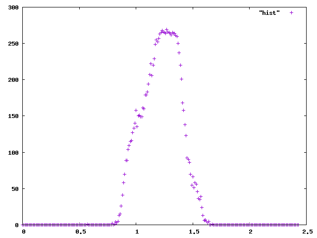

### 20160302 A toy example: 

Just by way of example, let us consider an extreme case of this
phenomenon where A is an arithmetic progression.  First let us think
about `A = {Mk : k a positive integer}` for a positive integer M > 1.
Then 

```
FT(1_A)(x) = sum_{k = 0 to N/M} e(Mkx)
```

So when x = aN/M for integer a, this takes a maximal value of N/M.  On
the other hand, when x = aN/M + l for some nonzero l, then the sum is 

```
FT(1_A)(x) = sum_{k = 0 to N/M} e(lk)
           = (z^(lN/M)-1)/(z^l-1)
```

Where `z = e^(2pi i/N)`.

Likewise, it is the case that (1_A * 1_A)(x) = 0 for any x not in the
progression.  Running the previous analysis, we see: 

```
(1_A * 1_A)(x)
 = (1/N) FT(FT(1_A) FT(1_A))(-x)
 = (1/N) sum_{t in Z} FT(1_A)(t)^2 e(-tx)
 = (1/N) sum_{a = 0 to M} (N/M)^2 e(-(aN/M)x) + (1/N) sum_{t not a/M} FT(1_A)(t)^2 e(-tx)
 = (1/N) (N/M)^2 sum_{a = 0 to M-1} e(-(aN/M)x) + (1/N) sum_{t not aN/M} FT(1_A)(t)^2 e(-tx)
```

If x is not a multiple of M, then this first sum is 0, and the second
term is 0 (for the morbidly curious:

```
(1/N) sum_{t not aN/M} FT(1_A)(t)^2 e(-tx) 
= (1/N) sum_{l = 1 to N/M-1} sum_{a = 0 to M-1} FT(1_A)(aN/M+l)^2 e(-(aN/M+l)x)
= (1/N) sum_{l = 1 to N/M-1} ((z^(lN/M)-1)/(z^l-1))^2 sum_{a = 0 to M-1} e(-(aN/M+l)x)
= (1/N) sum_{l = 1 to N/M-1} e(-lx)((z^(lN/M)-1)/(z^l-1))^2 sum_{a = 0 to M-1} e(-axN/M)
```

and the inner sum dies).  

If x is a multiple of M, then the first term is N/M (as the sum
evaluates to M), whereas the second term becomes a kind of interesting exponential sum: 

```
(M/N) sum_{l = 1 to N/M-1} e(-lx)((e(lN/M)-1)/(e(l)-1))^2
```

Rough calculation (though not proof) suggests that the magnitude of
the summands can be cheaply bounded if N/M is at all large by 4, at
which point this entire term is bounded below by:

```
>= -(M/N) sum_{l = 1 to N/M-1} |((e(lN/M)-1)/(e(l)-1))^2|
>= -(M/N) sum_{l = 1 to N/M-1} 4
>= -(M/N) (N/M) 4
>= - 4
```

So `(1_A*1_A)(x) >= N/M - 4` so if the progression has at least four
terms then this technique (if the guessed estimation above is correct)
computes what values have representations as sums of pairs of sequence
elements, as we hope to do for the Ulam numbers.  However in this
example, we did have to compute the "small, extra coefficients" sum
somewhat precisely than just applying a blanket bound.


### 20160305 Ulam with sums of 3 elements

At a suggestion of Brian Cook, we consider the "3-Ulam" numbers defined as
unique sums of 3 distinct smaller 3-Ulam numbers, starting with 1, 2, 3.  

The sequence computed to 5000 terms with a relatively naive algorithm
is found [here](seqs/seq1,2,3).  This, it turns out, has an even
larger peak in the Fourier transform at `alpha=0.23034156`, which is approximately `2pi*18/491` with 

```
|FT(1_A)(alpha)| = 4593.9993
FT(1_A)(alpha) = -746.9632560433929 + 4532.866159153438 i
```

We note also that 

```
>>> a=-747
>>> b=4533
>>> a**3-3*a*b**2
45631434726
>>> 3*a**2 * b-b*b*b
-85556123046
```

and 

```
>>> (3*(atan(4533/-747)+pi))*180/pi
298.07327027292246
```

So `FT(1_A)(alpha)^3` has an argument of about 300 degrees.  Since the
main term that we expect to control the behaviour of the convolution
`1_A * 1_A * 1_A` is `FT(1_A)(alpha)^3 e^(-i alpha x)`, and it should
be xs that make this a large real number that have many
representations as sums of 3 3-Ulam numbers.  Before, since
`FT(1_A)^2` was close to a positive real number, x being close to 0
mod lambda worked, meaning the distribution of 2-Ulam numbers was
expected to be relatively well centred, and it was.  For 3-Ulam
numbers, this indicates we might expect it to be shifted in some way.  Computing a histogram, we find; 

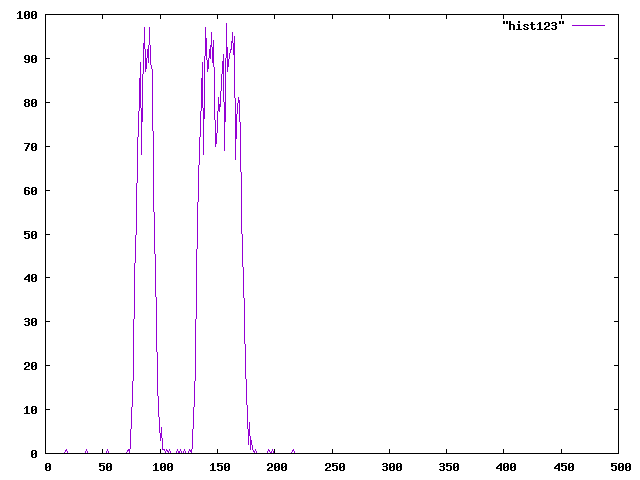


### 20160305 The second largest Fourier coefficient

In the toy example above, we had many large Fourier coefficients that
together controlled the behaviour of the sequence.  In the Ulam case,
we have been expecting the one largest peak to do this job, but possibly 

In the interest of bounding the convolution above, maybe instead of
looking near to alpha, we should look near the second largest Fourier
coefficient.  For example, an arithmetic progression with skip M has
maximal Fourier coefficient at 1/M, but also has one of reasonable
size at 2/M even if it doesn't span the whole interval 0-N.  


### 20160307 Circle method

It turns out that this business of counting representations by using
information about the Fourier coefficients has an established method
called "the circle method", though as normally stated this is a little
more refined than we've expressed here.

We'll run through a more complete calculation in a later note, but the
sort of calculation we might consider, roughly, looks like:

```r_{2A}(x) = integral_[0,1] FT(1_A)(t)^2 e(-tx)dt```

Since we know around t = +-alpha and t = 0 there are large spikes, we
can treat small intervals around these are the "major arcs": 

```r_{2A}(x) = integral_M(0) FT(1_A)(t)^2 e(-tx)dt
 + integral_M(alpha) FT(1_A)(t)^2 e(-tx)dt
 + integral_m FT(1_A)(t)^2 e(-tx)dt```

where 

```
M(0) = [1-eta,1] u [0,eta]
M(alpha) = [lambda-eta,lambda+eta] u [1-lambda-eta,1-lambda+eta]
m = the rest of [0,1]
```

and where eta is some chosen width for these arcs.  Let `delta` be the
density of `A`.  Then if, for example, `eta=delta/(2|A|)`, then

```integral_M(0) FT(1_A)(t)^2 e(-tx)dt >= delta/2 |A|```

whereas (at least for x in the range we are considering, where
e(lambda x) has real part >= 1/2)

```integral_M(alpha) FT(1_A)(t)^2 e(-tx)dt >= 2 delta/2 (3/4)^2 (1/2) |A|
 = 9 delta/32 |A|```

If further we assume that on `m`, `FT(1_A(t))` is bounded by `C
 sqrt(|A|)`, then 

```|integral_m FT(1_A)(t)^2 e(-tx)dt| <= C^2 delta |A|```

So the major and minor arc terms have the same growth rates.  This is
borne out by computations (but in the cases where the minor arc
contributions are large, they are positive, so they actually
contribute representations.  Saying something about the argument of
these contributions seems hard, however.)

The way the exponents worked out, however, we should expect a better
result if we instead ran a similar computation for `r_{3A}`, which
should give us insight (or even a proof of something!) about the
3-Ulam sequence analysed earlier.

### 20160317 Some identities

Because there is a relationship between `1_A` and `r_2A` by definition
and by the Fourier transform, we can write down many identities
relating the Fourier coefficients of `1_A` to, e.g., |A|.  

For example, there are some basic ones: 

* `1_A = 1(r_{2A} == 2)`
* `r_{A+A} = 1_A * 1_A (x) = FT(FT(1_A)^2) (-x)` (Convolution and Fourier inversion)
* `sum_t |FT(1_A)(t)|^2 = m|A|` (Plancherel)

However, the structure of the sequence gives us more: For example, if
we count triples a, b, x all in A with a+b=x, then in fact each x in A
determines a and b up to swapping, so there should only be 2|A|
solutions.  Put another way

* `r_{A+A-A}(0) = 2|A|`

or, applying the same convolution/Fourier inversion business as before: 

* `sum_t |FT(1_A)(t)|^2 FT(1_A)(t) = m|A|` (by the above and Fourier inversion)

### 20160330 d-Ulam numbers?

It seems to be classically the case that the circle method does better
for estimating representations of a number as a sum of many elements
of a set A.  Indeed, the case of "sums of two Ulam numbers" that we
study to analyse the standard Ulam sequence appears to be the hardest
yet.  

As a heuristic suggesting this, take A_N to be the indicator function
of Ulam numbers up to N.  Suppose somehow we know that have the three
major arcs at 0, k, and m-k (mod m) with |FT(A_N)(+-k)| = cN, and
|FT(A_N)(0)| = dN.  Then the Fourier transform on everything else
might behave something like |FT(A_N)(t)| = O(sqrt(N)).  (This is not
literally true, but this is perhaps the best thing we could hope for.)
Then we could compute, for x in the "far outlier range"
(-lambda/6,lambda/6) (i.e. `Re(e(kx)) >= 1/2`):

```
r_2A(x) = (1/m) sum_{t=0}^{m-1} FT(A_N)(t)^2 e(-tx)
        >= (1/m) (d^2 N^2 + c^2 N^2 + sum_{t != 0, +-k} FT(A_N)(t)^2 e(-tx))
        >= (1/m) (O(N^2) - sum_{t != 0, +-k} |FT(A_N)(t)|^2)
        >= (1/m) (O(N^2) - sum_{t != 0, +-k} |O(sqrt(N))|^2)
        >= (1/m) (O(N^2) - O(mN))
        >= (1/m) (O(N^2) - O(N^2))
```

which we cannot say much about, since the major and minor arcs have
the same order of magnitude.  (Also, throughout we are assuming A has
positive density so that m is O(N).)

In practice, it does appear that the "major arc" terms dominate (see a
separate post later today) but they do not dominate in absolute value.
So to push this type of argument through, we would need a careful
study of the arguments of everything involved as well as the
magnitude.

Having said that, if we consider the case of "d-Ulam" numbers--the
sequence defined to start with some specified increasing sequence of
length d (e.g. 1, 2, ..., d) and suppose again that this has two
single "major arcs" of size O(N), one at 0 and one at +-k, and the
rest of size O(sqrt(N)), then for x again in the appropriate range to
make Re(e(kx)) >= 1/2 we can say:

```
r_dA(x) = (1/m) sum_{t=0}^{m-1} FT(A_N)(t)^d e(-tx)
        >= (1/m) (O(N^d) + c^2 N^2 + sum_{t != 0, +-k} FT(A_N)(t)^d e(-tx))
        >= (1/m) (O(N^d) - sum_{t != 0, +-k} |FT(A_N)(t)|^d)
        >= (1/m) (O(N^d) - sum_{t != 0, +-k} |O(sqrt(N))|^d)
        >= (1/m) (O(N^d) - O(mN^{d/2}))
        >= (1/m) (O(N^d) - O(N^{d/2 + 1}))
```

which should go to infinity for `d/2+1 < d`, i.e. `d > 2`.  So by some
analysis of the constants, assuming we knew what we claim about the
major and minor arcs, we could prove that the "far outlier" range is
completely void of Ulam numbers and likely even that the "near
outlier" range (where Re(e(kx)) >= -1/2+epsilon) has only finitely
many Ulam numbers.

In fact, depending on d, we did not need the Fourier transform on the
minor arcs to be as small as sqrt(N) for this to work.  If it is some
`N^(1-1/s)`, then the same argument will work for `d > s`.

But now there is the question of whether these statements about the
sizes of the major and minor arcs are true.

### 20160330 How major are the major arcs?

`experiment28` of test.py tests the sizes of the 

For the Ulam numbers mod 540/221, the following are the largest
Fourier coefficients: 

The second column is log(|FT(A_N)|)/log(N) a N grows.  So we see that
while 221 is close to O(N), there are quite a few others that appear
to be above O(sqrt(N)):

```
...
369 0.6378215743971684 (214.3101514959669, -283.8135425426877)
171 0.6378215743974017 (214.31015149758795, 283.8135425424214)
392 0.6791557335650175 (-24.536161490635408, -519.8099128041274)
148 0.6791557335673123 (-24.53616148345205, 519.8099128154764)
73 0.6977134530096784 (-614.9469501497889, -54.72624497335534)
467 0.6977134530125786 (-614.9469501646479, 54.72624499241206)
246 0.835636470344478 (1029.3315017966531, -1942.97005220292)
294 0.8356364703454697 (1029.3315017807863, 1942.9700522340543)
417 0.8535414939136978 (404.91202378011684, -2561.1453812633777)
123 0.853541493913701 (404.91202378329444, 2561.14538126295)
442 0.8706641466946238 (3008.0920675294187, 409.48858461829263)
98 0.8706641466948764 (3008.0920675415896, -409.4885845812055)
25 0.9057186499880385 (-375.3499266607925, 4175.741239806747)
515 0.905718649989376 (-375.3499265654346, -4175.741239867164)
196 0.9193276419714349 (-810.7021265993675, 4682.720629366757)
344 0.9193276419721422 (-810.7021266792884, -4682.720629384336)
221 0.9741546188910715 (-7741.471072159591, -1438.5547650363962)
319 0.9741546188912089 (-7741.471072187735, 1438.5547649394791)
```

These are the Fourier coefficients with the top 18 growth rates.  We
note with interest that these all correspond to `+/- 221*t` for small t:

```
$ k=221; m=540; for x in {1..9}; do echo $x $(((x*k)%m)) $((((m-k)*x)%m)); done
1 221 319
2 442 98
3 123 417
4 344 196
5 25 515
6 246 294
7 467 73
8 148 392
9 369 171
```

The full list of k with apparently `|FT(A_N)(k)| > O(sqrt(N))` is in
[data/major_arcs_1_2](data/major_arcs_1_2).

Likewise, for the 3-Ulam sequence starting 1,2,3, we have
[data/major_arcs_1_2_3](data/major_arcs_1_2_3), with excerpt: 

```
180 0.817821268510748 (725.7948514263265, -770.6508608750067)
311 0.8178212685108903 (725.7948514357006, 770.6508608679418)
149 0.8285517308308487 (-866.97317108188, -770.5657654996639)
342 0.8285517308311429 (-866.97317109123, 770.5657654935192)
167 0.8318715136546837 (778.8521859294007, -903.9193004032385)
324 0.8318715136549053 (778.8521859221736, 903.9193004124376)
72 0.85086128149522 (-219.39911687104723, 1385.3564609439788)
419 0.8508612814954545 (-219.39911691709338, -1385.3564609395223)
162 0.8843089354764948 (-736.7458080652906, -1713.1656281161866)
329 0.8843089354765867 (-736.7458080454395, 1713.1656281263106)
54 0.8969506158487784 (1327.523005044359, -1597.172479555565)
437 0.896950615848911 (1327.523005089195, 1597.17247952135)
90 0.9014952719698207 (-1271.0858863632063, -1744.922605160494)
401 0.9014952719700488 (-1271.0858863086755, 1744.9226052054025)
144 0.9259371757329898 (-2546.620870004256, 762.57830023542)
347 0.9259371757331403 (-2546.6208700163957, -762.578300206755)
108 0.9361061459536614 (2693.5693102538094, -1071.3838260708062)
383 0.9361061459541083 (2693.569310310496, 1071.383825958141)
126 0.9428717941875684 (879.9655204689706, 2941.9688648900114)
365 0.9428717941875782 (879.9655204658437, -2941.9688648912106)
36 0.9576076881132913 (-3317.9516300259866, -1053.9932948584678)
455 0.9576076881133295 (-3317.951630003762, 1053.993294932172)
18 0.9899831544018998 (-584.7951594566562, 4549.134020819845)
473 0.9899831544019125 (-584.7951595337117, -4549.134020810446)
```

Again, these come largely from t*18 mod 491 for small t:

```
$ k=18; m=491; for x in {1..10}; do echo $x $(((x*k)%m)) $((((m-k)*x)%m)); done
1 18 473
2 36 455
3 54 437
4 72 419
5 90 401
6 108 383
7 126 365
8 144 347
9 162 329
10 180 311
```

So perhaps the circle method argument would properly go by arguing
that these all the large Fourier coefficients arise this way and then
bounding their influence on the number of representations.  For
example, if in the 3-Ulam case most of the Fourier coefficients have
size `N^{2/3}` but a small number have size larger than this, we can
still break apart the sum accordingly and bound each piece separately.

### 20160413 Representations of Ulam numbers as A+A+A

In the spirit of trying to get a handle on representations in dA for
larger d, we can ask what is the number of representations of any Ulam
number

[The data formerly here was computed by a slightly incorrect program]

Without trying to be clever, we can compute these using the
worst-looking piece of code in this whole business:

```
l = u1_2[:300]
d = {a:0 for a in l}
for x in l:
    for y in l:
        for z in l:
            if x+y+z in d:
                d[x+y+z] += 1
                
for i in range(len(l)):
    print(i,l[i],d[l[i]],d[l[i]]/l[i])
```

```
0 1 0 0.0
1 2 0 0.0
2 3 1 0.3333333333333333
3 4 3 0.75
4 6 10 1.6666666666666667
5 8 15 1.875
6 11 21 1.9090909090909092
7 13 24 1.8461538461538463
8 16 30 1.875
9 18 37 2.0555555555555554
10 26 30 1.1538461538461537
11 28 42 1.5
12 36 30 0.8333333333333334
13 38 45 1.1842105263157894
14 47 63 1.3404255319148937
15 48 55 1.1458333333333333
16 53 60 1.1320754716981132
17 57 96 1.6842105263157894
18 62 99 1.596774193548387
19 69 78 1.1304347826086956
20 72 108 1.5
21 77 126 1.6363636363636365
22 82 114 1.3902439024390243
23 87 117 1.3448275862068966
24 97 102 1.0515463917525774
25 99 141 1.4242424242424243
26 102 123 1.2058823529411764
27 106 189 1.7830188679245282
28 114 151 1.3245614035087718
29 126 228 1.8095238095238095
30 131 213 1.6259541984732824
31 138 213 1.5434782608695652
32 145 198 1.3655172413793104
33 148 231 1.5608108108108107
34 155 243 1.5677419354838709
35 175 240 1.3714285714285714
36 177 300 1.694915254237288
37 180 249 1.3833333333333333
38 182 333 1.8296703296703296
39 189 267 1.4126984126984128
40 197 363 1.8426395939086295
41 206 303 1.470873786407767
42 209 357 1.708133971291866
43 219 345 1.5753424657534247
44 221 408 1.8461538461538463
45 236 426 1.805084745762712
46 238 387 1.6260504201680672
47 241 423 1.7551867219917012
48 243 432 1.7777777777777777
49 253 468 1.849802371541502
50 258 465 1.802325581395349
51 260 504 1.9384615384615385
52 273 411 1.5054945054945055
53 282 540 1.9148936170212767
54 309 558 1.8058252427184467
55 316 477 1.509493670886076
56 319 609 1.9090909090909092
57 324 627 1.9351851851851851
58 339 501 1.4778761061946903
59 341 669 1.9618768328445748
60 356 615 1.7275280898876404
61 358 738 2.0614525139664805
62 363 762 2.0991735537190084
63 370 684 1.8486486486486486
64 382 621 1.62565445026178
65 390 729 1.8692307692307693
66 400 633 1.5825
67 402 834 2.074626865671642
68 409 714 1.745721271393643
69 412 828 2.0097087378640777
70 414 880 2.1256038647342996
71 429 927 2.160839160839161
72 431 807 1.8723897911832947
73 434 960 2.2119815668202767
74 441 954 2.163265306122449
75 451 969 2.1485587583148558
76 456 954 2.0921052631578947
77 483 990 2.049689440993789
78 485 1086 2.239175257731959
79 497 1014 2.0402414486921527
80 502 1086 2.1633466135458166
81 522 1071 2.0517241379310347
82 524 1137 2.1698473282442747
83 544 1230 2.261029411764706
84 546 1201 2.1996336996337
85 566 1242 2.1943462897526502
86 568 1176 2.0704225352112675
87 585 1242 2.123076923076923
88 602 1143 1.898671096345515
89 605 1356 2.2413223140495866
90 607 1299 2.14003294892916
91 612 1299 2.122549019607843
92 624 1224 1.9615384615384615
93 627 1498 2.3891547049441786
94 646 1293 2.001547987616099
95 668 1323 1.9805389221556886
96 673 1362 2.023774145616642
97 685 1260 1.8394160583941606
98 688 1638 2.380813953488372
99 690 1389 2.0130434782608697
100 695 1458 2.097841726618705
101 720 1590 2.2083333333333335
102 722 1716 2.376731301939058
103 732 1692 2.3114754098360657
104 734 1482 2.019073569482289
105 739 1647 2.2286874154262515
106 751 1443 1.9214380825565913
107 781 1797 2.30089628681178
108 783 1773 2.264367816091954
109 798 2049 2.5676691729323307
110 800 1728 2.16
111 820 2124 2.5902439024390245
112 847 2001 2.3624557260920898
113 849 2127 2.5053003533568905
114 861 1710 1.9860627177700347
115 864 2121 2.454861111111111
116 866 1980 2.2863741339491916
117 891 2040 2.2895622895622894
118 893 2166 2.425531914893617
119 905 1800 1.988950276243094
120 927 1990 2.1467098166127294
121 949 2019 2.1275026343519494
122 983 1524 1.550356052899288
123 986 2400 2.4340770791075053
124 991 2523 2.5459132189707367
125 1018 2223 2.1836935166994107
126 1020 2376 2.3294117647058825
127 1023 2284 2.2326490713587486
128 1025 2613 2.549268292682927
129 1030 2643 2.566019417475728
130 1032 2052 1.9883720930232558
131 1035 2559 2.472463768115942
132 1037 2265 2.184185149469624
133 1052 2715 2.5807984790874525
134 1079 2631 2.438368860055607
135 1081 2463 2.278445883441258
136 1101 2790 2.534059945504087
137 1103 2733 2.4777878513145963
138 1125 2733 2.429333333333333
139 1155 2391 2.07012987012987
140 1157 2976 2.572169403630078
141 1164 2523 2.167525773195876
142 1167 3009 2.5784061696658096
143 1169 2886 2.468776732249786
144 1186 2793 2.3549747048903877
145 1191 2925 2.455919395465995
146 1208 2679 2.2177152317880795
147 1230 2892 2.351219512195122
148 1252 2841 2.2691693290734825
149 1257 3129 2.4892601431980905
150 1296 3213 2.4791666666666665
151 1308 2436 1.8623853211009174
152 1311 3681 2.807780320366133
153 1313 2814 2.143183549124143
154 1335 2787 2.087640449438202
155 1338 3369 2.5179372197309418
156 1340 3198 2.3865671641791044
157 1355 3579 2.641328413284133
158 1360 3579 2.6316176470588237
159 1377 3579 2.599128540305011
160 1387 3354 2.418168709444845
161 1389 3795 2.7321814254859613
162 1404 3543 2.5235042735042734
163 1406 3693 2.626600284495021
164 1428 3630 2.542016806722689
165 1431 3438 2.40251572327044
166 1433 3990 2.784368457780879
167 1462 2967 2.0294117647058822
168 1465 3876 2.6457337883959045
169 1470 3957 2.6918367346938776
170 1472 4059 2.7574728260869565
171 1489 3864 2.595030221625252
172 1492 3918 2.6260053619302948
173 1509 4008 2.6560636182902586
174 1514 3903 2.5779392338177014
175 1516 4047 2.6695250659630605
176 1531 4251 2.776616590463749
177 1536 3906 2.54296875
178 1538 4386 2.8517555266579975
179 1550 3624 2.338064516129032
180 1553 4167 2.683193818415969
181 1594 3765 2.36198243412798
182 1602 4158 2.595505617977528
183 1604 4686 2.9214463840399003
184 1616 3963 2.452351485148515
185 1641 4428 2.6983546617915906
186 1643 4449 2.7078514911746803
187 1646 4278 2.5990279465370594
188 1648 5136 3.116504854368932
189 1660 4233 2.55
190 1682 4149 2.4667063020214033
191 1707 4686 2.7451669595782073
192 1709 5043 2.9508484493856058
193 1721 3948 2.294015107495642
194 1724 5115 2.9669373549883993
195 1748 4608 2.6361556064073226
196 1765 3948 2.236827195467422
197 1770 4908 2.772881355932203
198 1790 5331 2.9782122905027935
199 1792 5115 2.8543526785714284
200 1812 5103 2.816225165562914
201 1814 4902 2.7023153252480707
202 1834 5277 2.8773173391494002
203 1836 5368 2.923747276688453
204 1853 4740 2.5580140313005937
205 1856 5358 2.886853448275862
206 1858 5379 2.8950484391819162
207 1900 5631 2.9636842105263157
208 1902 5805 3.05205047318612
209 1919 5094 2.6545075560187597
210 1941 4989 2.57032457496136
211 1944 5499 2.8287037037037037
212 1946 5961 3.063206577595067
213 1966 5790 2.945066124109868
214 1968 6177 3.138719512195122
215 1985 5394 2.7173803526448363
216 2010 5853 2.9119402985074627
217 2012 6372 3.1669980119284293
218 2032 5820 2.8641732283464565
219 2034 6630 3.2595870206489677
220 2054 5871 2.858325219084713
221 2056 6627 3.223249027237354
222 2090 5511 2.636842105263158
223 2093 6288 3.0043000477783086
224 2095 6363 3.037231503579952
225 2112 5631 2.6661931818181817
226 2115 6357 3.0056737588652482
227 2117 6414 3.0297590930562115
228 2134 5799 2.717432052483599
229 2156 6156 2.855287569573284
230 2178 6141 2.819559228650138
231 2247 6357 2.829105473965287
232 2249 7236 3.2174299688750554
233 2252 6093 2.705595026642984
234 2254 7818 3.468500443655723
235 2288 6924 3.0262237762237763
236 2327 6012 2.5835840137516115
237 2330 7128 3.0592274678111586
238 2332 7377 3.1633790737564325
239 2354 7365 3.128717077315208
240 2371 6366 2.6849430619991566
241 2393 6795 2.839531968240702
242 2418 7131 2.9491315136476426
243 2420 7773 3.21198347107438
244 2445 6636 2.7141104294478526
245 2447 8367 3.4192889252145484
246 2462 7410 3.009748172217709
247 2464 8307 3.3713474025974026
248 2481 7311 2.946795646916566
249 2484 7062 2.842995169082126
250 2486 8073 3.247385358004827
251 2511 6909 2.751493428912784
252 2513 8859 3.525268603263032
253 2525 7977 3.1592079207920793
254 2550 7428 2.9129411764705884
255 2552 8841 3.4643416927899686
256 2572 7689 2.98950233281493
257 2574 9288 3.6083916083916083
258 2581 5856 2.268888027896164
259 2584 8082 3.1277089783281733
260 2589 7995 3.0880648899188876
261 2613 8436 3.2284730195177955
262 2616 7527 2.8772935779816513
263 2618 9195 3.5122230710466003
264 2628 8073 3.0719178082191783
265 2630 7377 2.8049429657794676
266 2633 8130 3.0877326243828334
267 2635 8955 3.398481973434535
268 2650 8328 3.1426415094339624
269 2660 7458 2.803759398496241
270 2662 9177 3.4474079639368895
271 2674 7971 2.980927449513837
272 2696 8484 3.1468842729970326
273 2721 8151 2.9955898566703416
274 2723 9714 3.567388909291223
275 2748 7641 2.78056768558952
276 2750 9864 3.586909090909091
277 2762 8841 3.2009413468501084
278 2787 8319 2.984930032292788
279 2789 9954 3.569021154535676
280 2809 8526 3.035243859024564
281 2811 10392 3.6969050160085377
282 2814 7692 2.7334754797441363
283 2816 10101 3.587002840909091
284 2831 8676 3.0646414694454256
285 2833 10407 3.673490998941052
286 2897 8991 3.103555402140145
287 2899 11100 3.828906519489479
288 2916 10365 3.5545267489711936
289 2919 8745 2.995889003083248
290 2921 11025 3.7743923313933583
291 2985 8607 2.8834170854271357
292 2987 10857 3.6347505858721125
293 3029 8418 2.7791350280620666
294 3031 10950 3.6126690861101944
295 3038 8394 2.763001974983542
296 3041 10134 3.3324564288063137
297 3043 10377 3.4101215905356557
298 3065 10629 3.467862969004894
299 3068 10158 3.3109517601043024
```

Not much to comment on at the moment.  

Repeating for 4A: 

```
l = u1_2[:100]
d = {a:0 for a in l}
for x in l:
    for y in l:
        for z in l:
            for w in l:
                if x+y+z+w in d:
                    d[x+y+z+w] += 1
                
for i in range(len(l)):
    print(i,l[i],d[l[i]],d[l[i]]/l[i])
```

Giving: 

```
0 1 0 0.0
1 2 0 0.0
2 3 0 0.0
3 4 1 0.25
4 6 10 1.6666666666666667
5 8 31 3.875
6 11 68 6.181818181818182
7 13 92 7.076923076923077
8 16 131 8.1875
9 18 160 8.88888888888889
10 26 326 12.538461538461538
11 28 314 11.214285714285714
12 36 506 14.055555555555555
13 38 484 12.736842105263158
14 47 500 10.638297872340425
15 48 682 14.208333333333334
16 53 748 14.11320754716981
17 57 624 10.947368421052632
18 62 696 11.225806451612904
19 69 1016 14.72463768115942
20 72 939 13.041666666666666
21 77 1040 13.506493506493506
22 82 1292 15.75609756097561
23 87 1416 16.275862068965516
24 97 1840 18.969072164948454
25 99 1720 17.373737373737374
26 102 2182 21.392156862745097
27 106 1782 16.81132075471698
28 114 2694 23.63157894736842
29 126 2418 19.19047619047619
30 131 2652 20.244274809160306
31 138 2694 19.52173913043478
32 145 3100 21.379310344827587
33 148 3146 21.256756756756758
34 155 3376 21.780645161290323
35 175 4380 25.02857142857143
36 177 3648 20.610169491525422
37 180 4958 27.544444444444444
38 182 3920 21.53846153846154
39 189 4760 25.185185185185187
40 197 4840 24.568527918781726
41 206 5446 26.436893203883496
42 209 5172 24.74641148325359
43 219 6264 28.602739726027398
44 221 5396 24.41628959276018
45 236 6270 26.56779661016949
46 238 6718 28.22689075630252
47 241 7104 29.477178423236513
48 243 6760 27.818930041152264
49 253 7240 28.616600790513836
50 258 7926 30.72093023255814
51 260 7406 28.484615384615385
52 273 10584 38.76923076923077
53 282 8720 30.921985815602838
54 309 9956 32.22006472491909
55 316 11916 37.70886075949367
56 319 10180 31.912225705329153
57 324 10984 33.901234567901234
58 339 15212 44.87315634218289
59 341 11796 34.592375366568916
60 356 14684 41.247191011235955
61 358 11952 33.385474860335194
62 363 12596 34.69972451790633
63 370 13338 36.04864864864865
64 382 16308 42.69109947643979
65 390 14588 37.40512820512821
66 400 18394 45.985
67 402 14366 35.7363184079602
68 409 17264 42.210268948655255
69 412 16122 39.13106796116505
70 414 15828 38.231884057971016
71 429 16428 38.29370629370629
72 431 18048 41.874709976798144
73 434 17672 40.71889400921659
74 441 16904 38.33106575963719
75 451 17760 39.37915742793792
76 456 19377 42.49342105263158
77 483 23536 48.7287784679089
78 485 20408 42.07835051546392
79 497 23716 47.71830985915493
80 502 22686 45.191235059760956
81 522 25080 48.04597701149425
82 524 23791 45.402671755725194
83 544 26526 48.7610294117647
84 546 25826 47.3003663003663
85 566 28512 50.37455830388693
86 568 27912 49.140845070422536
87 585 30844 52.72478632478632
88 602 36252 60.21926910299003
89 605 28688 47.41818181818182
90 607 31844 52.46128500823723
91 612 30836 50.38562091503268
92 624 37742 60.48397435897436
93 627 30524 48.68261562998405
94 646 40870 63.26625386996904
95 668 41488 62.10778443113772
96 673 38204 56.7667161961367
97 685 49612 72.42627737226277
98 688 34424 50.03488372093023
99 690 44694 64.77391304347826
```


### 20160418 Sum-free sets: simple introduction

Sum-free sets are sets which contain no solution to the equation
x+y=z.  Two fundamental examples are:

* The odd numbers, the integers that are 1 mod 3, or more generally,
  the set of all integers that reduce mod m to a sum-free set modulo
  m.  We call such sets "periodic".

* Even more generally, the integers that reduce mod some real alpha to
  a sum-free set in R/(alpha Z).  The "biggest" possible such example
  would be a set of integers that reduces to live in the inteval from
  `alpha/3` to `2*alpha/3` modulo alpha.

Gibbs has asked whether the phenomenon for the Ulam sequence has to do
with sets that are sum-free.  In a sense, the Ulam sequence looks to
be about sum-free: Most of the elements modulo alpha lie in the middle
third, meaning that if we exclude all elements outside this middle
third the set actually becomes sum-free.  Certainly in the Ulam case,
the set of Ulam numbers outside the middle third of the interval mod
alpha seem seems to be density 0 in the sequence.  This might
generalise, and Gibbs has asked whether for any sequence A where for
each a in A, r_2A(a) is bounded, we can remove a density-zero
subsequence to turn A into an actually sum-free set.

Sum-free sets are known to be in bijection with binary sequences (if
you like, sequences of coin-flips) by the following simple procedure:
Whatever your sequence A looks like so far, find the first possible
integer that is neither in A nor in 2A.  Flip a coin.  If heads,
include that integer as the next element of A, and if tails, excude
that integer, move on to the next candidate, and repeat the procedure.

The binary sequence that encodes the results of all these coin-flips
for a given sum-free set is called the set's "decision sequence".
From a given sum-free set we can easily back out the decision
sequence: For each integer n, there are three possibilities: 

* n is in A, in which case write a 1
* n is in A+A, in which case write nothing
* n is neither in A or in A+A, in which case write 0

The procedure for turning a decision sequence into a set is
implemented as the function `theta` in the test.py, while the
procedure to turn a set into a sequence is the function `thetainv`
(following the notation of the papers I've read that explain the
correspondence).

As an example for sum-free set, say, of odd numbers except 1: 3, 5, 7,
9, ..., we can write the decision sequence:

* 1 is in not in A or A+A, so **0**
* 2 is in not in A or A+A, so **0**
* 3 is in A, so **1**
* 4 is in not in A or A+A, so **0**
* 5 is in A, so **1**
* 6 is in A+A, so write nothing
* 7 is in A, so **1**

and then it is clear that all even numbers thereafter will be in A+A
and all odds in A, so the decision sequence is `00101111111111111...`
We will write this as `0010r1` for "0010 and then repeat the pattern
'1' forever".  

If the decision sequence eventually settles to a repeating pattern,
then often the sum-free set is one of the "lift of a sum-free set mod
m" sequences of the first kind above.  However, there are examples of
periodic decision sequences not known to give periodic sum-free sets.
For example, `r01001`, `r01010`, and `r10010` are the only period-5
sequences not known to give periodic sum-free sets (interestingly the
two other rotations of this--`r00101` and `r10100`--are known to give
periodic sets).

A fascinating paper that provides some evidence that these three sets
are in fact not periodic is
[here](www.emis.de/journals/INTEGERS/papers/a3int2003/a3int2003.pdf).

Nevertheless, there is a possibility these sets could have an
irrational "period" of sorts in the sense of the second kind of
sum-free set we mentioned at the beginning.  To detect this, what else
would we do other than search for the maximal Fourier coefficient?
For `r01001` we can do this analysis rather easily with some code
like:

```
l = theta("01001",10000)[0]
find_alpha(l,s=0.2,prec=4)
```

This gives us a sequence starting like:

```
2,6,9,14,19,26,29,36,39,47,54,64,69,79,84,91,96,106,109,121,...
```

and a value of alpha=2.508619.  

Using Magma, we compute the continued fraction (and first few
convergents) of alpha/2pi to be:

```
[ 2, 1, 1, 53, 2, 2, 6, 7, 149, 8, 1, 4, 1, 3, 12, 1, 1, 13, 4, 3, 1, 1, 11, 1, 1, 1, 2 ]
1/2
1/3
2/5
107/268
216/541
539/1350
3450/8641
24689/61837
...
```

The 53 means that in fact alpha/2pi is quite close indeed to 2/5, but
this doesn't seem to be an error of approximation, as 216/541 does do
better.  

At any rate, we can as usual plot a histogram of the values of 216*a_n
mod 541 and see what we get: 

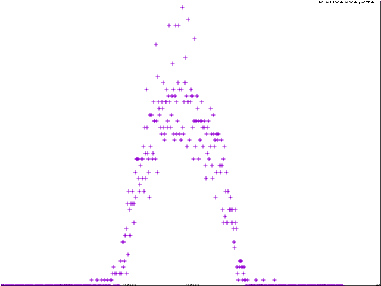.  

Very interesting...

Notably, as far as we can verify, however, there do appear to be
elements of the sequence that lie outside the middle third mod 541.

### 20160511 Sum-free sets: some questions and some data

Further computation of the set from `r01001` seems to give a value of
alpha close to 2.5086204384047996.  Given that the process that
generates it is some simple periodic one, it might make more sense to
expect this number to be algebraic.  Something to check in future.

Also, we ran the same histogram plotting business for `r10010` and got
a new alpha, did continued fraction business etcetc and got a rather
striking picture:

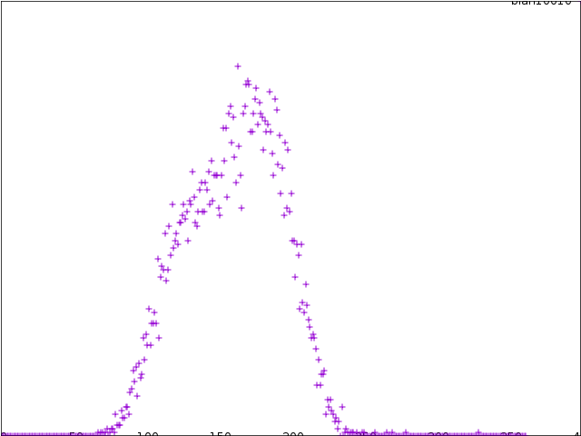.  

This very blatantly oversteps the middle third, in exchange for what
looks like greater non-uniformity than would be expected of a proper
"middle-third mod some alpha" set.

Another suggestion from the world of Ergodic theory is the idea of
applying the shift operator.  In that world, this operator is an
Ergodic map on the space of all sequences of positive integers and so
one can do things with it (significantly, prove Roth's theorem and
other additive combinatorics results).  For this example, we might
consider the much more naive approach of saying "suppose we take
theta(r01001), left shift it by 1, and then compute the decision
sequence of that.  If theta(r01001) is periodic, then of course it
remains so if we chop off the first element.  It is also known that
the decision sequence corresponding to an eventually periodic sum-free
set is eventually periodic.

In our case, however, we get: 

```
ll = thetainv(theta("10010",10000)[0][1:],4500)
for x in ll:
    print(x,end="")

0000100100010010010010001010001010010100100100010010010100100100101001
0100101001001001010010100101001010010100101000101000101001010010100101
0010100010100101001010010100101001010010100101001010010100101001010010
1001010010100101001010010010010100101001010010100101001010010100101001
0010010100101001010010100101001010010010010100101001010010100101001010
0101001010010100101001010010100101001010010100101001010010100101001010
0101001010010100101001010010100101001010010100101001010010100101001010
0101001010010100101001010010100101001010010100101001010010100101001010
0101001010010100101001010010100101001010010100101001010010100101001010
0101001010010100100100101001010010100101001010010100101001010010100101
0010100101001010010100101001010010100101001010010100101001010010100101
0010100101001010010010010100101001010010100101001010010100101001010010
1001010010100101001010010100101001010010100101001010010100101001010010
100101001010010100101001010010100101001010010100010100101001010
```

This looks a lot like a repeating 01001 sequence, except it has some
extra 0s stuck in occasionally.  These will correspond to a in A such
that the only solution to x+y=a in A is 2+(a-2)=a.

In other words, if the function `1_A(a)*1_A(a-2)` is eventually
periodic, then so too will this shifted sequence be.  

### 20160516 Decay of harmonics

There is a general principle in Fourier analysis that decaying Fourier
coefficients correspond to better smoothness properties of the
function.  Some intuition for this, which I learned
[here](http://www-m7.ma.tum.de/foswiki/pub/M7/Analysis/Fourier13/lecture9.pdf),
is a non-smooth point on a function should be thought of as having a
large derivative there, and if the Fourier series is

`f(x) = sum_n a_n e(nx)`,

then the only terms with very large derivative are those with large n.
So if there are sharp points in the function (i.e. points with very
large derivative), then the coefficients of the only terms that can
give large derivatives (i.e. large n) can't be too small.

Precise results on this usually apply to continuous functions, but
there are results for functions that satisfy the weaker condition of
Holder continuity:

```
|f(x) - f(y)| <= C |x-y|^a
```

A theorem of Zygmund implies that a periodic such a function has the
property that its kth Fourier coefficient bounded above by M k^(-a)
(with constant `M = pi^a*C/2`).

An indicator function might be reasonably approximated by a
piecewise-linear function which would be Holder continuous with C = 1
and a = 1.  If we could use this to prove a result like

```
|FT(1_{A_N})(k*alpha)/N| <= alpha/|k|
```

for any integer k, then we might have better control over the types of
sums we were trying to estimate in the circle method.  For example, if
we knew further that as N goes to infinity, FT(1_{A_N})(x)/N goes to 0
unless `x = k*alpha` for integer `k` (that is, a more realistic
version of the statement that "alpha is the only large Fourier
coefficient"), then we could compute

```
             r_2A(x) =  1/N sum_t FT(1_A)(t)^2 e(-tx)
(as N to infinity)   =  1/N sum_k FT(1_A)(k*alpha)^2 e(-k*alpha*x)
                     >= 1/N |A| + (2/N)*Re(FT(1_A)(alpha)^2 * e(alpha*x)) - sum_k={2..infinity} alpha^2/k^2
```

This sum on the right is bounded, and perhaps for values larger than 2
could be proven to be small enough to ignore.  The first term is the
density of A and we believe is going to a non-zero positive constant,
and the middle term will be positive or negative depending on the
argument of FT(1_A) and the value of x mod alpha.  In particular, this
could give us for in a certain range mod alpha that there are a large
number of representations, guaranteeing their exclusion from the set A.  

### 20160519 There is at least one large Fourier coefficient in a positive-density sum-free set

There are several positive-density sum-free sets that we can write
down, such as the odd positive integers, or the integers that lie in
(alpha/3,2 alpha/3) when taken modulo alpha (for any alpha in
R--rational or irrational, though only for irrational alpha is this
guaranteed to be positive density).  

These constructions are all in some way periodic, and we might wonder
whether this is necessary.  Motivated by the observations for the Ulam
sequence and the above sum-free sets, a simple statement in this
direction would be the following: If A is a positive-density sum-free
set of the positive integers, and 1_N is the indicator function of the
elements of A up to N/2, viewed as a function on Z/N, then there is
some s for which FT(1_N)(s) ~ O(N) as N grows, appropriately
understood.  

Nailing down this statement precisely requires some work, but for a
first shot at the kind of argument that will give it, let A be our
sum-free set of density d in Z/N, and let S be the total number of
solutions to x+y=z with x,y,z all in A.  

Then as we've discussed many times, 

```
0 = S = (1/N) sum_{t=0..N-1} FT(1_A)(t) FT(1_A)(t) FT(1_A)(-t)
```

Using the positive density, we can pull out the t=0 term which is
`|A|^3 = d^3 N^3`.  Then we can upper-bound the remaining sum by
pulling out an FT(1_A)(t) and replacing it with -max_t FT(1_A)(t): 

```
0 = S >= d^3 N^2 - max_{t=1..N-1}(FT(1_A)(t)) (1/N) sum_{t=1..N-1} |FT(1_A)(t)|^2
```

By Plancherel, `(1/N) sum_{t=0..N-1} |FT(1_A)(t)|^2 = sum_{t=0..N-1} 1_A(t) = |A|`, so:

```
0 = S >= d^3 N^2 - max_{t=1..N-1}(FT(1_A)(t)) |A| = S >= d^3 N^2 - max_{t=1..N-1}(FT(1_A)(t)) dN
```

Thus if `max_{t=1..N-1}(FT(1_A)(t)) <= eN`, then 

```
0 = S >= N^2 (d^3 - de)
```

In particular, e >= d^2, i.e. for some k, 

```
FT(1_A)(k) > d^2 N
```

Intuitively, by pulling out the Fourier coefficient at 0, we are
saying "Considering density alone, we might expect d^3 N^2 solutions
(there are d^2 N^2 sums, and absent any other considerations we might
expect elements of A to occur with density d, giving d^3 N^2 sums in
A).  Any deviation from this is going to require at least one Fourier
coefficient on the order of N to counteract the potential solutions
coming from positive density."  Put another way "if the set is dense,
then to avoid solutions it needs to have some kind of pattern (such as
being all odds)."  The statement we have here is a first version of
precisely the kind of thing that we wanted to be able to say.

Some remarks: 

* How this k varies a N grows is the main question--if k/N is more or
  less "stable" eventually, then this may be the thing that we want.
  One possible way to get this may be to say that if we let N grow and
  take k_N to be the index of the largest Fourier coefficient, then
  first of all the sequence of arguments of the maximal Fourier
  coefficient is an infinite sequence on the unit circle--a compact
  set--and therefore has a convergent subsequnece.  If k_i mod N_i is
  the sequence of indices of the maximal coefficients in this
  subsequence, then they give an infinite sequence in [0,1]--also a
  compact set.  These, therefore have a convergent subsequence meaning
  we can find some limiting alpha with FT(1_{A_N})(alpha)/N converging
  to a constant larger than zero.

* This is a large Fourier coefficient but it may differ from our
  observed "very large" Fourier coefficient in two ways: This argument
  doesn't guarantee us one that is as large as we seem to be seeing,
  and it doesn't require that there is only one.

* The main difference between this and my previous attempts is mostly
  the willingness to consider the total number of solutions in the
  entire set, rather than to count the representations of any
  individual number.

* In the proof of Roth's theorem, the existence of a large Fourier
  coefficient in A is somehow used to deduce the existence of an
  arithmetic progression P such that A intersected with P has higher
  density in P than A had in Z/N.  Roth's theorem concludes by making
  all this numerically precise to be able to say "if we repeat this
  often enough, either we'll eventually have small Fourier coefficient
  relative to the increased density, or we'll have density 1 in an
  arithmetic progression at which point...well...we will be guaranteed
  to contain an arithmetic progression!"  In our case, we are always
  guaranteed a largeish Fourier coefficient by the above argument, so
  maybe we can always perform this "density increment" step until we
  are literally an arithmetic progression.  Precisely what this
  implies about the Fourier coefficients of the original 1_A or
  whether this ensures us any global behaviour of the sequence A
  depends on precisely how the density-increment step goes.  This will
  be a another thing to investigate shortly.

* The same argument works not just for sum-free sets, but for any set
  A_N for which where the number of solutions to x+y=z grows more
  slowly than N^2.  In particular, it also works for the Ulam sequence
  (where the growth is exactly dN), or for any sequence A such that
  for any a in A, the number of x,y in A with x+y=a is bounded above
  by a constant.  It is interesting to note that this argument does
  not take advantage of the uniformity with which these solutions
  occur in the Ulam case, however.  For example, it also applies to a
  sequence where a_{2^i+1}..., a_{2^(i+1)-1} have no representations
  but a_{2^i} has 2^{i-1} representations for each i (in which case
  the number of representations is not bounded above, but is growing,
  albeit sort of slowly and non-uniformly).

### 20160520 A possible programme for understanding the phenomenon

* Be able to tell when sum-free or boundedly-additive sets have positive density

  This seems hard and it is not clear what the desired statement is.
  For example, one guess is that sum-free sets with periodic decision
  sequences have positive density.  Or that sum-free sets with
  positive-density of 1s in the decision sequence have themselves
  positive density.  Saying anything about the decision sequence of
  the sum-free-ification of the Ulam sequence is unclear.  Maybe this
  is the place to look for an analogue of the decision sequence for
  1-additive sets?

* Prove that boundedly-additive sets of positive density have a single large Fourier coefficient

* Prove that a single large Fourier coefficient implies the desired result

These start of these last two steps is perhaps somewhat adumbrated in
the previous two posts.